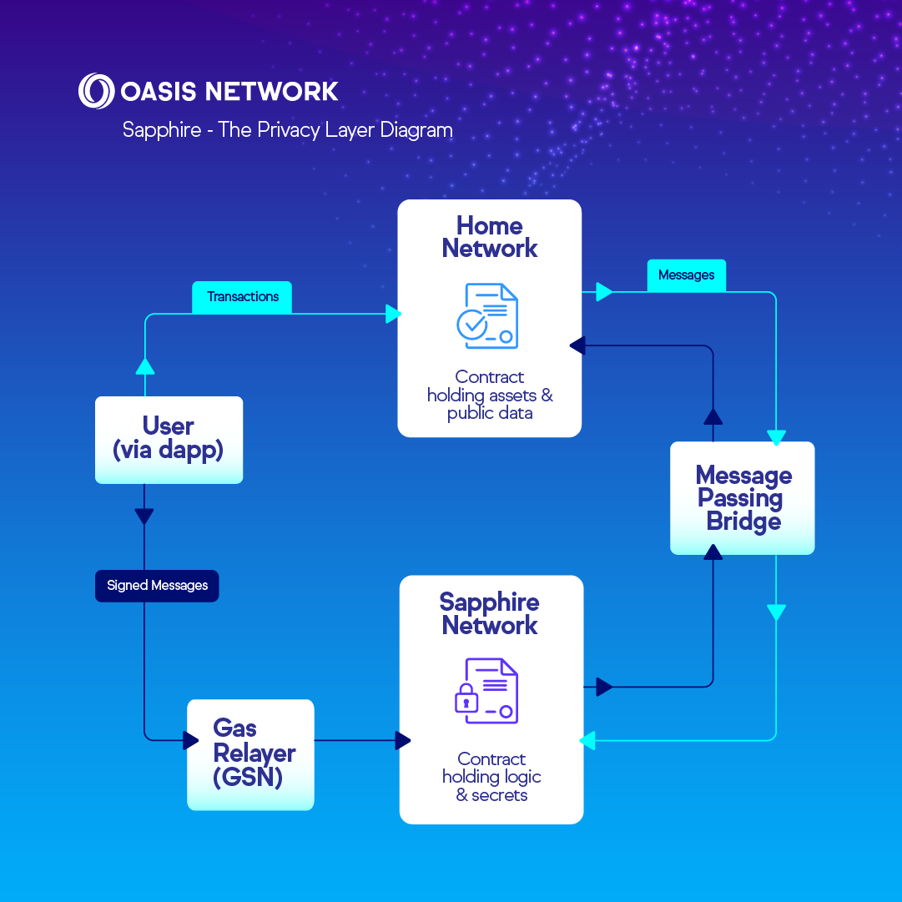

import DocCard from '@theme/DocCard';
import DocCardList from '@theme/DocCardList';
import {findSidebarItem} from '@site/src/sidebarUtils';

# Oasis Privacy Layer (OPL)

The Oasis Privacy Layer (OPL) is a powerful solution that enables developers
to integrate privacy features into their decentralized applications (dApps)
across multiple EVM-compatible networks.

- **Privacy-First**: OPL leverages the [Sapphire]'s privacy features to ensure
that contract data and computation remains confidential.
- **Cross-Chain Compatibility**: OPL is compatible with multiple blockchains
through message bridging protocols, making it easy to integrate privacy
regardless of the chain your dApp is built on.

For more information about OPL and to catch the latest news, please visit the
[official OPL page].

[official OPL page]: https://oasisprotocol.org/opl
[Sapphire]: https://github.com/oasisprotocol/docs/blob/main/docs/build/sapphire/README.mdx

## How OPL Works

The OPL is made possible through message bridges, which enable secure
communication between OPL-enabled contracts on Sapphire and smart contracts on
other chains. This allows dApps to access privacy-preserving capabilities while
keeping their main logic on their primary chain.

:::info

For how to use use signed messages with the GSN to trigger a cross-chain
messages, please visit our [Gasless Transactions chapter].

:::

[Gasless Transactions chapter]: https://github.com/oasisprotocol/docs/blob/main/docs/build/sapphire/develop/gasless.md

## Message Bridges

You can integrate message bridges into your dApps using one of these four
methods:

- **[OPL SDK]**: A wrapper provided by the Oasis Protocol that simplifies the
integration of message bridging with Oasis’s privacy features.
- **[Celer Inter-Chain Messaging (IM)][celer]**: A generalized message bridging
solution by Celer, which lets you build more complex solutions.
- **[Hyperlane Protocol][hyperlane]**: A permissionless interoperability
protocol that enables seamless cross-chain communication for developers.
- **[Router Protocol CrossTalk][router]**: An extensible cross-chain framework
that enables seamless state transitions across multiple chains.

### Comparison

| Protocol                      | Validator Network                   | Relayer                                                | Fees                                                                                   |
| ----------------------------- | ----------------------------------- | ------------------------------------------------------ | -------------------------------------------------------------------------------------- |
| **[OPL SDK]**                 | SGN (Celer)                         | Executor (self-hosted or  hosted service by Celer) | SGN Fee: Paid via `msg.value`   Executor Fee: Charged externally (Free on testnet) |
| **[Celer IM][celer]**         | SGN (Celer)                         | Executor (self-hosted or  hosted service by Celer) | SGN Fee: Paid via `msg.value`   Executor Fee: Charged externally (Free on testnet) |
| **[Hyperlane][hyperlane]**    | Self-hosted or run by Hyperlane | Self-hosted or  run by Hyperlane                   | Interchain Gas Payments on origin chain                                                |
| **[Router Protocol][router]** | Orchestrators (Router Chain)        | Relayer (run by 3rd party)                             | Paid by the approved feepayer on the Routerchain                                       |

### Recommendation

#### Development & Testing

**[Hyperlane][hyperlane]**: Due to its permissionless nature, it is easy to use
with other testnets, and you can easily run your own Relayer. This flexibility
makes it an ideal choice for hackathons, early-stage development and testing
environments.

#### Production

**[Router Protocol][router]**: Battle-tested by ecosystem dApps like Neby and
features the most active token pairs. It provides a highly reliable,
production-ready solution for cross-chain communication, making it a top
recommendation for production environments.

## Examples

<DocCardList items={[
    findSidebarItem('/build/opl/opl-sdk/ping-example'),
    findSidebarItem('/build/opl/celer/ping-example'),
    findSidebarItem('/build/opl/hyperlane/pingpong-example'),
    findSidebarItem('/build/opl/router-protocol/pingpong-example'),
    ]} />

[OPL SDK]: ./opl-sdk/README.md
[celer]: ./celer/README.md
[router]: ./router-protocol/README.md
[hyperlane]: ./hyperlane/README.md
