import DocCard from '@theme/DocCard';
import DocCardList from '@theme/DocCardList';
import {findSidebarItem} from '@site/src/sidebarUtils';

# Hyperlane Protocol

[Hyperlane] is a permissionless interoperability protocol that enables seamless
cross-chain communication for developers. Its unique design allows deployment
across various blockchain environments, including layer 1 chains, rollups, and
app-chains, without the need for approvals or intermediaries. This
[permissionless design] empowers developers to build cross-chain applications
with full control over their operations in a multi-chain ecosystem.

[Hyperlane]: https://hyperlane.xyz/
[permissionless design]: https://docs.hyperlane.xyz/docs/intro

### Architecture

*Basic Hyperlane cross-chain messaging flow[^1]*

[^1]: Architecture diagram is courtesy of [Hyperlane documentation][hyperlane-architecture]

[hyperlane-architecture]: https://docs.hyperlane.xyz/docs/protocol/protocol-overview

Hyperlane's architecture consists of four key components:

- **[Mailboxes]**: Core messaging contracts deployed on each chain that handle message sending/receiving
- **[Interchain Security Modules (ISMs)][ism]**: Custom security logic that determines how messages are verified
- **[Relayers]**: Off-chain agents that transport messages between chains
- **[Validators]**: Fulfilling the security layer of the Hyperlane protocol

[Mailboxes]: https://docs.hyperlane.xyz/docs/protocol/mailbox
[ism]: https://docs.hyperlane.xyz/docs/protocol/ISM/modular-security
[Relayers]: https://docs.hyperlane.xyz/docs/protocol/agents/relayer
[Validators]: https://docs.hyperlane.xyz/docs/protocol/agents/validators

## Fees

Hyperlane fees are called **Interchain Gas Payments** and are payed by the
*message sender* to the *relayer*.

For more info about the Interchain Gas Payments, consult the [Hyperlane documentation][igp]

[igp]: https://docs.hyperlane.xyz/docs/protocol/interchain-gas-payment

## See also

<DocCardList items={[
    findSidebarItem('/build/opl/hyperlane/cli'),
    findSidebarItem('/build/opl/hyperlane/relayer'),
    findSidebarItem('/build/opl/hyperlane/pingpong-example'),
]} />
