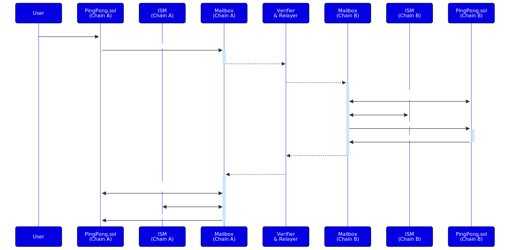

# Ping Pong Example

This tutorial demonstrates how to send a cross-chain message via
[Hyperlane Protocol].

[Hyperlane Protocol]: https://docs.hyperlane.xyz/docs/intro

You'll learn how to:

 - Deploy Hyperlane Mailbox-compatible contracts
 - Deploy trusted relayer ISM(Interchain Security Module)
 - Run a simple relayer
 - Send cross-chain messages

We recommend using [Hardhat] for an easy-to-follow experience.

:::example Code

You can find the contracts and hardhat tasks for deployment and execution
in our [demo-opl repository][opl].

[opl]: https://github.com/oasisprotocol/demo-opl/tree/main/examples/hyperlane-pingpong

:::

[Hardhat]: https://hardhat.org/

## Overview Ping Pong

In this example, you'll deploy a similar contract on two different chains.
The contract on Chain A will send a `ping` message to Chain B using
*Hyperlane Protocol*. The contract on Chain B will process this message and
respond with a `ping` back to Chain A.



## Setup

1. Create and navigate to a new directory:

    ```shell
    mkdir hyperlane-pingpong && cd hyperlane-pingpong
    ```

2. Initialize a Hardhat project and install dependencies:
  
    ```shell
    npx hardhat init
    ```

3. Add [`@hyperlane-xyz/core`] as dependency:

    ```shell npm2yarn
    npm install -D @hyperlane-xyz/core
    ```

:::info

There can be some problems with dependencies, be sure to have `ethers@^6` and
`openzeppelin@^4.9.3`.

:::

[`@hyperlane-xyz/core`]: https://www.npmjs.com/package/@hyperlane-xyz/core

### Test Token

Make sure you have enough test token on `Arbitrum Sepolia` and `Sapphire Testnet`

Get more:

- TEST tokens for `Sapphire Testnet` from the [Oasis Faucet].
- ETH tokens for `Arbitrum Sepolia` from Alchemy's [Faucet].

[Oasis Faucet]: https://faucet.testnet.oasis.io/
[Faucet]: https://faucets.alchemy.com/faucets/arbitrum-sepolia

### Add Networks to Hardhat

Open up your `hardhat.config.ts` and add Arbitrum Sepolia and Sapphire
Testnet.

```js title="hardhat.config.ts"
 import { HardhatUserConfig } from "hardhat/config";
 import "@nomicfoundation/hardhat-toolbox";

 // highlight-next-line
 const accounts = process.env.PRIVATE_KEY ? [process.env.PRIVATE_KEY] : [];

 const config: HardhatUserConfig = {
  solidity: "0.8.24",
  // highlight-start
  networks: {
    'arbitrum-sepolia': {
      url: 'https://arbitrum-sepolia-rpc.publicnode.com',
      chainId: 421614,
      accounts,
    },
    'sapphire-testnet': {
      url: "https://testnet.sapphire.oasis.io",
      accounts,
      chainId: 23295, // 0x5aff
    },
  },
  // highlight-end
 };

 export default config;
```

:::info

Sapphire only supports evmVersion `paris`, which is the current default for
Hardhat. Should Hardhat change this, you need to add `evmVersion: "paris"` to
the solidity config.

:::


### Ping Pong Contract

For this example we leverage the `Router` wrapper from *Hyperlane*. This results in
following advantages:

- Contracts are compatible with *Hyperlane*'s **MailboxClient** and **IMessageRecipient**
  interfaces.
- Supports *enrolling* Routers of other chains.
- Supports setting up a **custom ISM**.

1. Create a new file called `Ping.sol` for Arbitrum Sepolia
2. Paste the following contract into it:

 <details>
    <summary> Ping.sol Contract </summary>

  ```solidity title="Ping.sol" showLineNumbers
  // SPDX-License-Identifier: Apache-2.0
  pragma solidity ^0.8.13;

  // ============ External Imports ============
  import {Router} from "@hyperlane-xyz/core/contracts/client/Router.sol";

  /*
  * @title Ping
  * @dev You can use this simple app as a starting point for your own application.
  */
  contract Ping is Router {
      // A generous upper bound on the amount of gas to use in the handle
      // function when a message is processed. Used for paying for gas.
      uint256 public constant HANDLE_GAS_AMOUNT = 50_000;

      // A counter of how many messages have been sent from this contract.
      uint256 public sent;
      // A counter of how many messages have been received by this contract.
      uint256 public received;

      // Keyed by domain, a counter of how many messages that have been sent
      // from this contract to the domain.
      mapping(uint32 => uint256) public sentTo;
      // Keyed by domain, a counter of how many messages that have been received
      // by this contract from the domain.
      mapping(uint32 => uint256) public receivedFrom;

      // ============ Events ============
      event SentPing(
          uint32 indexed origin,
          uint32 indexed destination,
          string message
      );
      event ReceivedPing(
          uint32 indexed origin,
          uint32 indexed destination,
          bytes32 sender,
          string message
      );
      event HandleGasAmountSet(
          uint32 indexed destination,
          uint256 handleGasAmount
      );

      constructor(address _mailbox) Router(_mailbox) {
          // Transfer ownership of the contract to deployer
          _transferOwnership(msg.sender);
          setHook(address(0));
      }

      // ============ External functions ============

      /**
       * @notice Sends a message to the _destinationDomain. Any msg.value is
       * used as interchain gas payment.
       * @param _destinationDomain The destination domain to send the message to.
       * @param _message The message to send.
       */
      function sendPing(
          uint32 _destinationDomain,
          string calldata _message
      ) public payable {
          sent += 1;
          sentTo[_destinationDomain] += 1;
          _dispatch(_destinationDomain, bytes(_message));
          emit SentPing(
              mailbox.localDomain(),
              _destinationDomain,
              _message
          );
      }

      /**
       * @notice Fetches the amount of gas that will be used when a message is
       * dispatched to the given domain.
       */
      function quoteDispatch(
          uint32 _destinationDomain,
          bytes calldata _message
      ) external view returns (uint256) {
          return _quoteDispatch(_destinationDomain, _message);
      }

      // ============ Internal functions ============
      /**
       * @notice Handles a message from a remote router.
       * @dev Only called for messages sent from a remote router, as enforced by Router.sol.
       * @param _origin The domain of the origin of the message.
       * @param _sender The sender of the message.
       * @param _message The message body.
       */
      function _handle(
          uint32 _origin,
          bytes32 _sender,
          bytes calldata _message
      ) internal override {
          received += 1;
          receivedFrom[_origin] += 1;
          emit ReceivedPing(
              _origin,
              mailbox.localDomain(),
              _sender,
              string(_message)
          );
      }
  }
  ```

  </details>

3. Create a new file called `Pong.sol` for Sapphire Testnet
4. Paste the following contract into it:

 <details>
    <summary> Pong.sol Contract </summary>

  ```solidity title="Pong.sol" showLineNumbers
  // SPDX-License-Identifier: Apache-2.0
  pragma solidity ^0.8.13;

  // ============ External Imports ============
  import {Router} from "@hyperlane-xyz/core/contracts/client/Router.sol";

  /*
  * @title Pong
  * @dev You can use this simple app as a starting point for your own application.
  */
  contract Pong is Router {
      // A generous upper bound on the amount of gas to use in the handle
      // function when a message is processed. Used for paying for gas.
      uint256 public constant HANDLE_GAS_AMOUNT = 50_000;

      // A counter of how many messages have been sent from this contract.
      uint256 public sent;
      // A counter of how many messages have been received by this contract.
      uint256 public received;

      // Keyed by domain, a counter of how many messages that have been sent
      // from this contract to the domain.
      mapping(uint32 => uint256) public sentTo;
      // Keyed by domain, a counter of how many messages that have been received
      // by this contract from the domain.
      mapping(uint32 => uint256) public receivedFrom;

      // ============ Events ============
      event SentPing(
          uint32 indexed origin,
          uint32 indexed destination,
          string message
      );
      event ReceivedPing(
          uint32 indexed origin,
          uint32 indexed destination,
          bytes32 sender,
          string message
      );
      event HandleGasAmountSet(
          uint32 indexed destination,
          uint256 handleGasAmount
      );

      constructor(address _mailbox) Router(_mailbox) {
          // Transfer ownership of the contract to deployer
          _transferOwnership(msg.sender);
          setHook(address(0));
      }

      // ============ External functions ============

      /**
       * @notice Sends a message to the _destinationDomain. Any msg.value is
       * used as interchain gas payment.
       * @param _destinationDomain The destination domain to send the message to.
       * @param _message The message to send.
       */
      function sendPing(
          uint32 _destinationDomain,
          string calldata _message
      ) public payable {
          sent += 1;
          sentTo[_destinationDomain] += 1;
          _dispatch(_destinationDomain, bytes(_message));
          emit SentPing(
              mailbox.localDomain(),
              _destinationDomain,
              _message
          );
      }

      /**
       * @notice Fetches the amount of gas that will be used when a message is
       * dispatched to the given domain.
       */
      function quoteDispatch(
          uint32 _destinationDomain,
          bytes calldata _message
      ) external view returns (uint256) {
          return _quoteDispatch(_destinationDomain, _message);
      }

      // ============ Internal functions ============
      /**
       * @notice Handles a message from a remote router.
       * @dev Only called for messages sent from a remote router, as enforced by Router.sol.
       * @param _origin The domain of the origin of the message.
       * @param _sender The sender of the message.
       * @param _message The message body.
       */
      function _handle(
          uint32 _origin,
          bytes32 _sender,
          bytes calldata _message
      ) internal override {
          received += 1;
          receivedFrom[_origin] += 1;
          emit ReceivedPing(
              _origin,
              mailbox.localDomain(),
              _sender,
              string(_message)
          );
          // send return message
          sendPing(
              _origin,
              string(_message)
          );
      }
  }
  ```

  </details>

### ISM Contract

In the current state the default ISM of the `Arbitrum Sepolia` Mailbox won't
accept a message if you send a message from `Sapphire Testnet` to `Arbitrum
Sepolia`. You can deploy and register a custom ISM on the `Arbitrum Sepolia`
contract to make it work.

A simple default ISM from *Hyperlane* is a **TrustedRelayerISM**, which checks the
relayer address before delivering the message.

1. Create a new file called `TrustedRelayerIsm.sol`
2. Paste the following contract into it:

 <details>
    <summary> TrustedRelayerIsm.sol Contract </summary>

  ```solidity title="TrustedRelayerIsm.sol" showLineNumbers
  // SPDX-License-Identifier: MIT OR Apache-2.0
  pragma solidity >=0.8.0;

  // ============ Internal Imports ============
  import {IInterchainSecurityModule} from "@hyperlane-xyz/core/contracts/interfaces/IInterchainSecurityModule.sol";
  import {Address} from "@openzeppelin/contracts/utils/Address.sol";
  import {Message} from "@hyperlane-xyz/core/contracts/libs/Message.sol";
  import {Mailbox} from "@hyperlane-xyz/core/contracts/Mailbox.sol";
  import {PackageVersioned} from "@hyperlane-xyz/core/contracts/PackageVersioned.sol";

  contract TrustedRelayerIsm is IInterchainSecurityModule, PackageVersioned {
      using Message for bytes;

      uint8 public immutable moduleType = uint8(Types.NULL);
      Mailbox public immutable mailbox;
      address public immutable trustedRelayer;

      constructor(address _mailbox, address _trustedRelayer) {
          require(
              _trustedRelayer != address(0),
              "TrustedRelayerIsm: invalid relayer"
          );
          require(
              Address.isContract(_mailbox),
              "TrustedRelayerIsm: invalid mailbox"
          );
          mailbox = Mailbox(_mailbox);
          trustedRelayer = _trustedRelayer;
      }

      function verify(
          bytes calldata,
          bytes calldata message
      ) external view returns (bool) {
          return mailbox.processor(message.id()) == trustedRelayer;
      }
  }
  ```

  </details>


:::tip

If you want to read more about *Hyperlane's* **Interchain Security Modules,**
visit the [Hyperlane docs]

:::

[Hyperlane docs]: https://docs.hyperlane.xyz/docs/protocol/ISM/modular-security

### Key Contract Functions

- `sendPing`: Initiates the cross-chain message by calling *Hyperlane*'s
  `IMailbox.dispatch`.
- `enrollRemoteRouter`: In the inherited `Router` contract, to register the
  contract from the other chain.
- `setInterchainSecurityModule`: Set the ISM for the contract.
- `_handle`: To handle incoming messages from the Mailbox (internal function
  called by the inherited `Router` contract `handle` function).

## Deploying the Contracts

Deploy the Ping and Pong contracts on two different chains: `Sapphire Testnet` and
`Arbitrum Sepolia`.

Use for deploying either the provided `deploy-pingpong` and `deploy-ism` tasks
or use the scripts below.

### Deploying Pong on Sapphire Testnet

1. Create a deployment script `deploypong.ts` under `scripts/`:

    ```js title="deploy.ts"
    import { ethers } from "hardhat";

    async function main() {
      // deployed mailbox on Sapphire Testnet
      const mailbox = "0x79d3ECb26619B968A68CE9337DfE016aeA471435";

      const PongFactory = await hre.ethers.getContractFactory("Pong");    
      const pong = await PongFactory.deploy(mailbox);
      const pongAddr = await pong.waitForDeployment();
      console.log(`Pong deployed at: ${pongAddr.target}`);
    }
    main().catch((error) => {
      console.error(error);
      process.exitCode = 1;
    });
    ```

2. Run the deployment:

    ```shell
    pnpm hardhat run scripts/deploypong.ts --network sapphire-testnet
    ```

### Deploying Ping on Arbitrum Sepolia

1. Create a deployment script `deployping.ts` under `scripts/`:

    ```js title="deploy.ts"
    import { ethers } from "hardhat";

    async function main() {
      // default mailbox on Arbitrum Sepolia
      const mailbox = "0x598facE78a4302f11E3de0bee1894Da0b2Cb71F8";

      const PingFactory = await ethers.getContractFactory("Ping");    
      const ping = await PingFactory.deploy(mailbox);
      const pingAddr = await ping.waitForDeployment();
      console.log(`Ping deployed at: ${pingAddr.target}`);
    }
    main().catch((error) => {
      console.error(error);
      process.exitCode = 1;
    });
    ```

2. Run the deployment:

    ```shell
    pnpm hardhat run scripts/deployping.ts --network arbitrum-sepolia
    ```

### Deploying ISM on Arbitrum Sepolia

1. Create a deployment script `deployISM.ts` under `scripts/`:

    ```js title="deployISM.ts"
    import { ethers } from "hardhat";

    async function main() {
      // default mailbox on Arbitrum Sepolia
      const mailbox = "0x598facE78a4302f11E3de0bee1894Da0b2Cb71F8";
      const trustedRelayer = "0x<your relayer address>";

      const trustedRelayerISM = await ethers.deployContract(
        "TrustedRelayerIsm",
        [mailbox, trustedRelayer]
        );
      await trustedRelayerISM.waitForDeployment();
      console.log(`TrustedRelayerISM deployed to ${trustedRelayerISM.target}`);
    }
      main().catch((error) => {
        console.error(error);
        process.exitCode = 1;
      });
    ```

2. Run the deployment:

    ```shell
    pnpm hardhat run scripts/deployISM.ts --network arbitrum-sepolia
    ```

## Contracts setup

### Enroll Routers

As we use the Router wrapper for our Ping Pong contracts, we need to enroll the
contract addresses of the opposite contract.

#### Enroll Router on Sapphire Testnet

1. Create a file named `enroll.ts`in the folder `/scripts`

    ```js title="enroll.ts"
    import { ethers } from "hardhat";

    async function main() {      
      let pingpongArbitrum = "0x<your contract deployed before>";
      let pingpongSapphire = "0x<your contract deployed before>";
      let arbId = "421614";

      const signer = await ethers.provider.getSigner();
      const contract = await ethers.getContractAt("Pong", sapphireAddr, signer);
      await contract.enrollRemoteRouter(arbId, ethers.zeroPadValue(pingpongArbitrum, 32));
      const arbRouter = await contract.routers(arbId);
      console.log(`remote router adr for ${arbId}: ${arbRouter}`)
    }
    main().catch((error) => {
      console.error(error);
      process.exitCode = 1;
    });
    ```

2. Run the deployment

    ```shell
    pnpm hardhat run scripts/enroll.ts --network sapphire-testnet
    ```

#### Enroll Router on Arbitrum Sepolia

1. Create a file named `enroll.ts`in the folder `/scripts`

    ```js title="enroll.ts"
    import { ethers } from "hardhat";

    async function main() {
      let pingpongArbitrum = "0x<your contract deployed before>";
      let pingpongSapphire = "0x<your contract deployed before>";
      let sapphireId = "23295";

      const signer = await ethers.provider.getSigner();
      const contract = await ethers.getContractAt("Ping", pingpongArbitrum, signer);
      await contract.enrollRemoteRouter(sapphireId, ethers.zeroPadValue(pingpongSapphire, 32));
      const arbRouter = await contract.routers(sapphireId);
      console.log(`remote router adr for ${sapphireId}: ${arbRouter}`)
    }
    main().catch((error) => {
      console.error(error);
      process.exitCode = 1;
    });
    ```

2. Run the deployment

    ```shell
    pnpm hardhat run scripts/enroll.ts --network arbitrum-sepolia
    ```


### Register ISM on Arbitrum Sepolia

1. Create a file named `registerIsm.ts`in the folder `/scripts`

    ```js title="registerIsm.ts"
    import { ethers } from "hardhat";

    async function main() {      
      let pingpongArbitrum = "0x<your contract deployed before>";
      let ismAddr = "0x<your ISM contract deployed before>";

      const signer = await ethers.provider.getSigner();
      const contract = await ethers.getContractAt("Ping", pingpongArbitrum, signer);
      await contract.setInterchainSecurityModule(ismAddr);
    }
    main().catch((error) => {
      console.error(error);
      process.exitCode = 1;
    });
    ```

2. Run the deployment

    ```shell
    pnpm hardhat run scripts/registerIsm.ts --network arbitrum-sepolia
    ```

## Run Relayer

Before starting to test the Ping Pong, make sure to run a Relayer for `Arbitrum
Sepolia` and `Sapphire Testnet`.

For information about how to run a Relayer, visit our [Relayer page].

[Relayer page]: ./relayer.md

## Executing Ping Pong

To execute you will call the `sendPing` function on the `Ping.sol` contract.

In the `demo-opl` example you can use the provided `send-ping` task or you can
use the following script:

1. Create a file named `sendping.ts`in the folder `/scripts`

    ```js title="sendping.ts"
    import { ethers } from "hardhat";

    async function main() {
      const destChainId = "23295";
      const message = "Hello OPL"
      const pingpongArbitrum = "0x<your pingpong contract deployed on arbitrum sepolia"

      const signer = await ethers.provider.getSigner();
      const contract = await ethers.getContractAt("Ping", pingpongArbitrum, signer);

      console.log("Calculating fee...");
      let fee = await contract.quoteDispatch(
          destChainId,
          hre.ethers.toUtf8Bytes(message));
      console.log(`Fee: ${hre.ethers.formatEther(fee)} ETH`);
      console.log("Sending message...");
      const tx = await contract.sendPing(destChainId, message, {value: fee});
      await tx.wait();
      console.log("Message sent");
    }
    main().catch((error) => {
      console.error(error);
      process.exitCode = 1;
    });
    ```

2. Run the script

    ```shell
    pnpm hardhat run scripts/sendping.ts --network arbitrum-sepolia
    ```


## Verify Ping Pong

The most simple way to verify the cross-chain messaging is by checking the
blockchain explorer and check the transaction on your deployed `Ping`
contract.

If you want to monitor the events directly you can use this script:

1. Create a file named `verifyping.ts`in the folder `/scripts`

    ```js title="verifyping.ts"
    import { ethers } from "hardhat";

    async function main() {
      const contractAddr = "0x<your deployed ping contract on arbitrum sepolia>"
      const signer = await ethers.provider.getSigner();
      const contract = await ethers.getContractAt("Ping", contractAddr, signer);

      const spinner = ['-', '\\', '|', '/'];
      let spinnerIndex = 0;
      const interval = setInterval(() => {
          process.stdout.write(`\rListing for event... ${spinner[spinnerIndex]}`);
          current = (spinnerIndex + 1) % spinner.length;
      }, 150);

      let events;
      do {
        const block = await ethers.provider.getBlockNumber();
        events = await contract.queryFilter('ReceivedPing', block - 10, 'latest');
        if (events.length === 0) {
          await new Promise(resolve => setTimeout(resolve, 60 * 1000));
        }
      } while (events.length === 0);
      
      clearInterval(interval);
      process.stdout.write(`\r`); 
      process.stdout.clearLine(0);

      const parsedEvent = contract.interface.parseLog(events[0]);
      const message = parsedEvent?.args?.message;
      console.log(`Message received with: ${message}`);
    }
    main().catch((error) => {
      console.error(error);
      process.exitCode = 1;
    });
    ```

2. Run the script

    ```shell
    pnpm hardhat run scripts/verifyping.ts --network sapphire-testnet
    ```


## Troubleshooting

### Relayer doesn't relay message

Check:

- You have enrolled the opposite Router contract with `enrollRemoteRouter`
  by calling `ping.routers(oppositeChainId)`
- You have set the custom ISM on the `Arbitrum Sepolia` Ping contract by
  calling `ping.interchainSecurityModule`
- The relayer address matches the trusted ISM configuration.

### Can't verify messages

Check:

- Your Hardhat RPC allow historical event queries.
- Use a dedicated RPC provider (e.g., Alchemy) if necessary.
