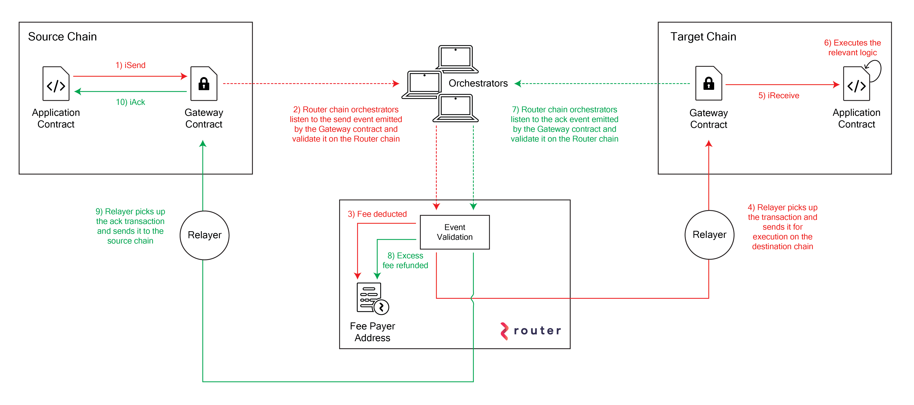

# Router Protocol

Router Protocol offers two frameworks for cross-chain interactions:

- **Router CrossTalk**: Enables stateless and stateful cross-chain messaging
- **Router Nitro**: Facilitates native cross-chain asset transfers

For guidance on choosing the appropriate framework, refer to Router's [guide].

This documentation focuses on **Router CrossTalk**. If you're primarily
interested in asset transfers, please consult the [Router Nitro documentation].

[Router Nitro documentation]: https://docs.routerprotocol.com/develop/category/asset-transfer-via-nitro
[guide]: https://docs.routerprotocol.com/overview/choosing-the-right-framework

## Router CrossTalk

Router CrossTalk is designed to enable cross-chain interactions, allowing
developers to create decentralized applications (dApps) that operate across
multiple blockchain networks. This framework supports both stateless and
stateful operations, providing flexible and efficient communication between
contracts on different chains.

### Architecture

*High-level architecture diagram for Router CrossTalk[^1]*

[^1]: The CrossTalk high-level architecture diagram is courtesy of [Router documentation][router-architecture].

[router-architecture]: https://docs.routerprotocol.com/develop/message-transfer-via-crosstalk/key-concepts/high-level-architecture

The **CrossTalk** infrastructure consists of three main components:

- **Gateway** contracts on source and destination chains
- **Orchestrators** on the Router chain
- **Relayers** that forward messages to the Router Gateway contracts

The process flow is as follows:

1. The dApp contract calls the iSend function on the source chain's Gateway
   contract.
2. Orchestrators monitor events emitted by the Gateway contract.
3. A Relayer picks up the transaction signed by the orchestrator and forwards
   the message to the destination chain's Router Gateway contract.
4. Gateway contract on the destination chain calls the dApp contract's
   `iReceive` function.
5. For acknowledgment, the process is reversed, and the Relayer calls the
   `iAck` function on the dApp contract on the source chain.

### Fees

Fees in the cross-chain messaging process are paid by two parties:

- The dApp **user** pays when initiating the transaction on the source chain.
- The dApp **fee payer** pre-pays the Relayers for calling the Router Gateway
  contract.

To ensure the correct **fee payer** is used, the dApp's contract must register
the fee payer address as metadata with the Router Gateway. Additionally, the
**fee payer** needs to approve the conntract on the Router chain, which can be
done through the [Router Explorer].

For more info about the [fee management], consult the Router documentation.

[Router Explorer]: https://testnet.routerscan.io/feePayer
[fee management]: https://docs.routerprotocol.com/develop/message-transfer-via-crosstalk/key-concepts/fee-management

### Examples

:::note Example: PingPong

Explore our [PingPong example] to see Router CrossTalk in action.

:::

[PingPong example]: ./pingpong-example.md

For more examples, refer to the  [Router Protocol documentation]:

- [Cross-Chain NFT]
- [Cross-Chain Read Request]

and in the Router Protocol [CrossTalk sample repository].

[Router Protocol documentation]: https://docs.routerprotocol.com/develop/message-transfer-via-crosstalk
[Cross-Chain NFT]: https://docs.routerprotocol.com/develop/message-transfer-via-crosstalk/evm-guides/your-first-crosschain-nft-contract
[Cross-Chain Read Request]: https://docs.routerprotocol.com/develop/message-transfer-via-crosstalk/evm-guides/cross-chain-read-requests
[CrossTalk sample repository]: https://github.com/router-protocol/new-crosstalk-sample/
