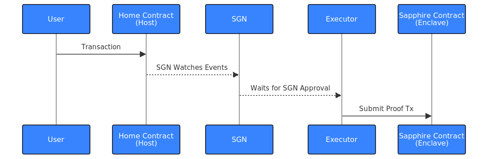

# Oasis Privacy Layer

The Oasis Privacy Layer (OPL) is an EVM-compatible privacy solution that
empowers developers to add new functionality to smart contracts on the most
popular EVM networks like Ethereum, BNB Chain, and Polygon with encrypted
transactions and confidential state.

By using [a Solidity library][sapphire-contracts]
that integrates [Sapphire] into your existing and future Web3 applications,
developers on any supported network can seamlessly add confidential state and
selective disclosures to their dApps when using contract a deployed on Sapphire
without leaving their existing networks.

For more information about OPL and to catch the latest news, please visit the
[official OPL page].


The user submits a transaction on the Home network to a contract which uses
`postMessage` to notify the SGN that it should approve the cross-chain message.
The Executor waits, when the SGN approves the message the Executor submits a
transaction to the target contract on Sapphire.



The Home Contract pays the SGN to watch and approve the message, but the
Executor needs to be run by somebody willing to pay for the gas to submit
transactions to the destination chain.

[sapphire-contracts]: https://www.npmjs.com/package/@oasisprotocol/sapphire-contracts
[Sapphire]: https://oasisprotocol.org/sapphire
[official OPL page]: https://oasisprotocol.org/opl

## Quickstart

A pair of contracts are linked bidirectionally 1-1 to each other across chains,
with one end on Sapphire and the other on a supported EVM-compatible chain (the
Home Network). They can post and receive messages to & from each other using the
message-passing bridge, but must register endpoints to define which messages
they handle from each other.

Start by adding the [`@oasisprotocol/sapphire-contracts`] NPM package to your
Hardhat project so you can import `OPL.sol`:

```shell
pnpm add @oasisprotocol/sapphire-contracts
```

[`@oasisprotocol/sapphire-contracts`]: http://npmjs.com/package/@oasisprotocol/sapphire-contracts

Then define the two contracts, starting with a contract on Sapphire which runs
inside the confidential enclave and can be called via the `secretExample`
handler. Use the constructor to provide the Sapphire contract with the location
(address and chain) of the contract on the Home network:

```solidity
import {Enclave, Result, autoswitch} from "@oasisprotocol/sapphire-contracts/contracts/OPL.sol";

contract SapphireContract is Enclave {
    constructor(address otherEnd, string chain) Enclave(otherEnd, autoswitch(chain)) {
        registerEndpoint("secretExample", on_example);
    }
    function on_example(bytes calldata _args) internal returns (Result) {
        (uint256 a, bool b) = abi.decode(args, (uint256, bool));
        // TODO: do confidential things here
        return Result.Success;
    }
}
```

Then on the other chain, define your contract which can be called via
`triggerExample` to send a message to the contract on Sapphire using the
`postMessage` interface.

```solidity
import {Host, Result} from "@oasisprotocol/sapphire-contracts/contracts/OPL.sol";

contract HomeContract is Host {
    constructor(address otherEnd) Host(otherEnd) {
    }
    function triggerExample (uint256 a, bool b) external payable {
        postMessage("secretExample", abi.encode(a, b));
    }
}
```

After a few minutes the bridge will detect and then the executor will invoke the
`SapphireContract.on_example` method.

## Monitoring

The Celer IM Scan API can be used to retrieve status and message details by
providing the globally unique transaction ID from the chain which originated the
message.

    https://api.celerscan.com/scan/searchByTxHash?tx=0x...

For details of the response format, see the [Query IM Tx Status] page of the
Celer Inter-Chain Message (IM) documentation. Using this API lets you to check
if messages have been delivered.

[Query IM Tx Status]: https://im-docs.celer.network/developer/development-guide/query-im-tx-status

## Mainnet Deployment

It is necessary to run a [Message Executor] which monitors the Celer *State
Guardian Network* (SGN) for cross-chain messages and then submits the proof
on-chain to deliver them to the target contract.

If you are participating in a Hackathon or Grant, [please fill out the relay
request form](https://form.typeform.com/to/RsiUR9Xz) to be allowed to use the
shared Message Executor.

[Message Executor]: https://im-docs.celer.network/developer/development-guide/message-executor

## Supported Networks

### Mainnets

| Name | Int ID | Hex ID | autoswitch name |
| ---- | ------ | ------ | --------------- |
| Ape | 16350 | 0x3fde | ape |
| Arbitrum Nova | 42170 | 0xa4ba | arbitrum-nova |
| Arbitrum One | 42161 | a4b1 | arbitrum-one |
| Astar | 592 | 0x250 | astar |
| Aurora | 1313161554 | 0x4e454152 | aurora |
| Avalanche | 43114 | 0xa86a | avalanche |
| Binance Smart Chain | 56 | 0x38 | bsc |
| Ethereum | 1 | 0x1 | ethereum |
| Fantom | 250 | 0xfa | fantom |
| Filecoin | 314 | 0x13a | filecoin |
| Milkomeda C1 | 2001 | 0x7d1 | milkomeda |
| Moonriver | 1285 | 0x505 | moonriver |
| Polygon | 137 | 0x89 | polygon |
| Sapphire | 23294 | 0x5afe | sapphire |
| Syscoin | 57 | 0x39 | syscoin |
| Polygon zkEVM | 1101 | 0x44d | polygon-zkevm |
| Optimism | 10 | 0xa | optimism |
| zkSync Era | 324 | 0x144 | zksync-era |

### Testnets

| Name | Int ID | Hex ID | autoswitch name |
| ---- | ------ | ------ | --------------- |
| Arbitrum Testnet | 421611 | 0x66eeb | arbitrum-testnet |
| Avalanche C-Chain Fuji Testnet | 43113 | 0xa869 | avalanche-fuji |
| BSC Testnet | 97 | 0x61 | bsc-testnet |
| ConsenSys zkEVM Testnet | 59140 | 0xe704 | zkevm-testnet |
| Dexalot Testnet | 432201 | 0x69849 | dexalot-testnet |
| Fantom Testnet | 4002 | 0xfa2 | fantom-testnet |
| Filecoin Hyperspace Testnet | 3141 | 0xc45 | filecoin-testnet |
| FNCY Testnet | 923018 | 0xe158a | fncy-testnet |
| Godwoken Testnet | 71401 | 0x116e9 | godwoken-testnet |
| Goerli Testnet | 5 | 0x5 | goerli |
| Polygon Mumbai Testnet | 80001 | 0x13881 | polygon-mumbai |
| Polygon zkEVM Testnet | 1442 | 0x5a2 | zkevm-testnet |
| Sapphire Testnet | 23295 | 0x5aff | sapphire-testnet |
| Scroll Alpha Testnet | 534353 | 0x82751 | scroll-testnet |
| Shibuya Testnet | 81 | 0x51 | shibuya-testnet |

In the following sections we will look at a concrete example on how to build a
confidential, cross-chain DAO-voting dApp from scratch using the Oasis Privacy Layer!
