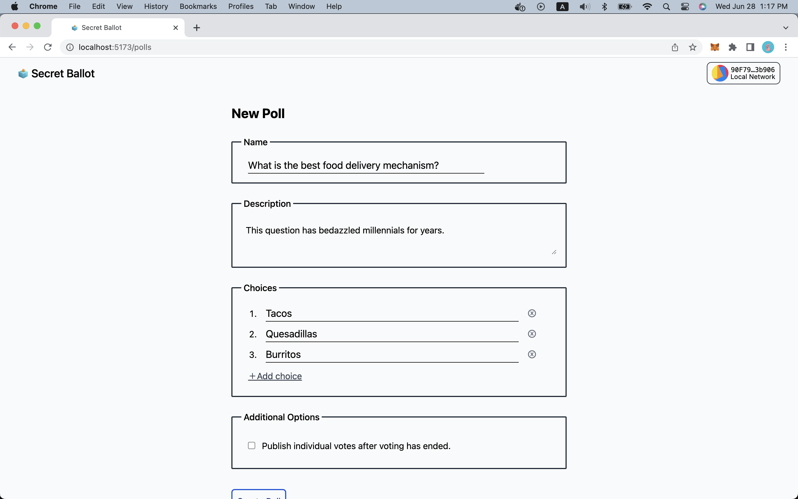
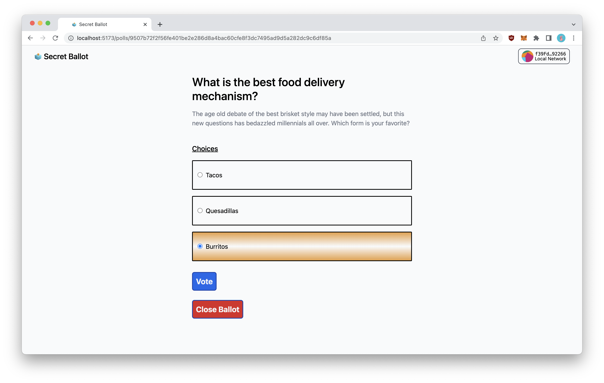

# Frontend Application

We will need a [Pinata](https://www.pinata.cloud) development API
[key](https://docs.pinata.cloud/docs/getting-started#2-generate-your-api-keys)
and JWT with the `pinFileToIPFS` permission. Let's obtain that first.

### VueJS

We will take a shortcut and bypass developing a VueJS app. Instead, we will
simply apply a sparse checkout of the complete frontend repo. Inside your
`opl-secret-ballot` directory run:

```sh
git init .
git remote add -f origin https://github.com/oasisprotocol/playground
git checkout origin/main opl-secret-ballot/frontend
mv opl-secret-ballot/frontend/ .
```

Next, update the `@oasislabs/secret-ballot-backend` package name in
`frontend/package.json` to match your `backend/package.json` project name.

We recommend using [pnpm](https://pnpm.io) to install dependencies, but `yarn`
and `npm` will work with some modifications around workspaces.

```sh
pnpm install
```

Compile and Hot-Reload for Development
```sh
pnpm run dev
```

Build assets for deployment
```sh
pnpm run build
```

We can now reference the deployed contracts in our frontend Vue app.

Modify the `.env.development` file with the appropriate addresses:
```yaml
VITE_BALLOT_BOX_V1_ADDR=0xFb40591a8df155da291A4B52E4Df9901a95b7C06
```
and
```yaml
VITE_DAO_V1_ADDR=0xFBcb580DD6D64fbF7caF57FB0439502412324179
```

### Pinata

Additionally, we will need a [Pinata](https://www.pinata.cloud) JWT
[key](https://docs.pinata.cloud/reference/datatestauthentication) to access the
pinning service with which we store our ballots as JSON.

```yaml
VITE_PINATA_JWT=
```

### Start

Start Vue app
```sh
pnpm run dev
```

### MetaMask

You can use one of the deployed test accounts and associated private key with
[MetaMask](https://metamask.io).

If you have not added a local network to MetaMask already, you can use this
configuration.

#### Localhost

* RPC HTTP endpoint: `http://127.0.0.1:8545/`
* Chain ID:
  * Decimal: 1337

## Example

You should be able to navigate to
[http://localhost:5173](http://localhost:5173) and create a new poll.



Confirm and sign a transaction to create a new poll (issues a request against
the Host contract).


Voting on a ballot issues a request to the *enclave* contract.



You should be able to see results from past polls.


If you were able to get to this point, congrats! You have created an OPL dApp!

:::info Example

You can try out and download a frontend of the secret ballot Dapp from the
[Oasis Playground repository][frontend-example].

:::

[frontend-example]: https://github.com/oasisprotocol/playground/tree/main/opl-secret-ballot/frontend
