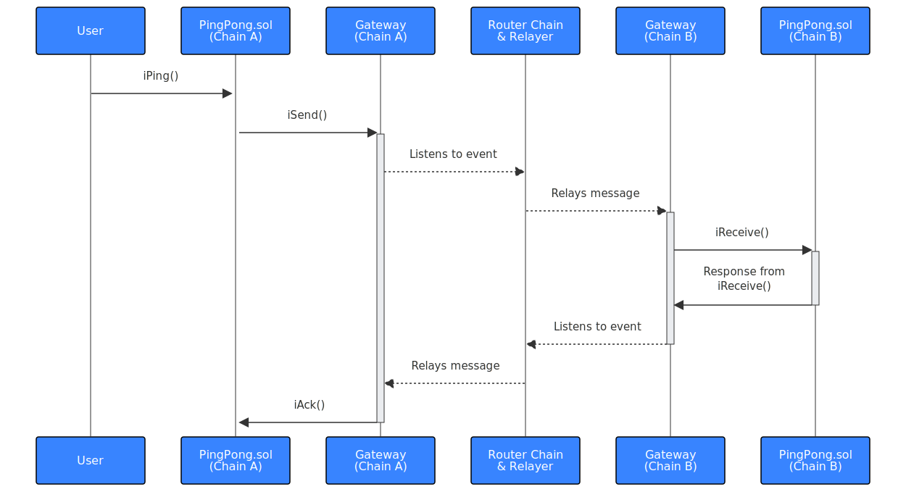

# PingPong Example

This tutorial demonstrates how to send a cross-chain message using Router
Protocol's [CrossTalk].

You'll learn how to:

 - Deploy Router-compatible contracts
 - Approve the feePayer for your contracts
 - Prepare metadata for cross-chain calls
 - Send cross-chain messages

We recommend using [Remix] for an easy-to-follow experience.
The only prerequisite is a set-up Metamask account.

:::info

If you're new to Remix, follow our basic guide for using Remix
[here][dapp-remix].

[dapp-remix]: /dapp/emerald/writing-dapps-on-emerald#create-dapp-on-emerald-with-remix---ethereum-ide

:::


## Overview PingPong

In this example, you'll deploy the same contract on two different chains.
You'll then send a `ping` from chain A to chain B, facilitated by Router
Protocol's [CrossTalk]. The contract on chain B will receive the `ping` and
respond back to Router Protocol. Finally, Router Protocol will send an
acknowledgment message back to the contract on chain A.



[CrossTalk]: https://docs.routerprotocol.com/develop/message-transfer-via-crosstalk

## Contract Setup

1. Open [Remix] and create a new file called `PingPong.sol`
2. Paste the following contract into it:

 <details>
        <summary> PingPong.sol Contract </summary>

        ```solidity title="PingPong.sol" showLineNumbers
        //SPDX-License-Identifier: UNLICENSED
        pragma solidity >=0.8.0 <0.9.0;

        import "@routerprotocol/evm-gateway-contracts/contracts/IGateway.sol";

        /// @title PingPong
        /// @author Yashika Goyal
        /// @notice This is a cross-chain ping pong smart contract to demonstrate how one can
        /// utilise Router CrossTalk for cross-chain transactions.
        contract PingPong {
            address public owner;
            uint64 public currentRequestId;

            // srcChainId + requestId => pingFromSource
            mapping(string => mapping(uint64 => string)) public pingFromSource;
            // requestId => ackMessage
            mapping(uint64 => string) public ackFromDestination;

            // instance of the Router's gateway contract
            IGateway public gatewayContract;

            // custom error so that we can emit a custom error message
            error CustomError(string message);

            // event we will emit while sending a ping to destination chain
            event PingFromSource(
                string indexed srcChainId,
                uint64 indexed requestId,
                string message
            );
            event NewPing(uint64 indexed requestId);

            // events we will emit while handling acknowledgement
            event ExecutionStatus(uint256 indexed eventIdentifier, bool isSuccess);
            event AckFromDestination(uint64 indexed requestId, string ackMessage);

            constructor(address payable gatewayAddress, string memory feePayerAddress) {
                owner = msg.sender;

                gatewayContract = IGateway(gatewayAddress);

                gatewayContract.setDappMetadata(feePayerAddress);
            }

            /// @notice function to set the fee payer address on Router Chain.
            /// @param feePayerAddress address of the fee payer on Router Chain.
            function setDappMetadata(string memory feePayerAddress) external {
                require(msg.sender == owner, "only owner");
                gatewayContract.setDappMetadata(feePayerAddress);
            }

            /// @notice function to set the Router Gateway Contract.
            /// @param gateway address of the gateway contract.
            function setGateway(address gateway) external {
                require(msg.sender == owner, "only owner");
                gatewayContract = IGateway(gateway);
            }

            /// @notice function to generate a cross-chain request to ping a destination chain contract.
            /// @param destChainId chain ID of the destination chain in string.
            /// @param destinationContractAddress contract address of the contract that will handle this
            /// @param str string to be pinged to destination
            /// @param requestMetadata abi-encoded metadata according to source and destination chains
            function iPing(
                string calldata destChainId,
                string calldata destinationContractAddress,
                string calldata str,
                bytes calldata requestMetadata
            ) public payable {
                currentRequestId++;

                bytes memory packet = abi.encode(currentRequestId, str);
                bytes memory requestPacket = abi.encode(destinationContractAddress, packet);
                gatewayContract.iSend{ value: msg.value }(
                1,
                0,
                string(""),
                destChainId,
                requestMetadata,
                requestPacket
                );
                emit NewPing(currentRequestId);
            }

            /// @notice function to get the request metadata to be used while initiating cross-chain request
            /// @return requestMetadata abi-encoded metadata according to source and destination chains
            function getRequestMetadata(
                uint64 destGasLimit,
                uint64 destGasPrice,
                uint64 ackGasLimit,
                uint64 ackGasPrice,
                uint128 relayerFees,
                uint8 ackType,
                bool isReadCall,
                string memory asmAddress
            ) public pure returns (bytes memory) {
                bytes memory requestMetadata = abi.encodePacked(
                destGasLimit,
                destGasPrice,
                ackGasLimit,
                ackGasPrice,
                relayerFees,
                ackType,
                isReadCall,
                asmAddress
                );
                return requestMetadata;
            }

            /// @notice function to handle the cross-chain request received from some other chain.
            /// @param packet the payload sent by the source chain contract when the request was created.
            /// @param srcChainId chain ID of the source chain in string.
            function iReceive(
                string memory, //requestSender,
                bytes memory packet,
                string memory srcChainId
            ) external returns (uint64, string memory) {
                require(msg.sender == address(gatewayContract), "only gateway");
                (uint64 requestId, string memory sampleStr) = abi.decode(
                packet,
                (uint64, string)
                );
                if (
                keccak256(abi.encodePacked(sampleStr)) == keccak256(abi.encodePacked(""))
                ) {
                revert CustomError("String should not be empty");
                }
                pingFromSource[srcChainId][requestId] = sampleStr;

                emit PingFromSource(srcChainId, requestId, sampleStr);

                return (requestId, sampleStr);
            }

            /// @notice function to handle the acknowledgement received from the destination chain
            /// back on the source chain.
            /// @param requestIdentifier event nonce which is received when we create a cross-chain request
            /// We can use it to keep a mapping of which nonces have been executed and which did not.
            /// @param execFlag a boolean value suggesting whether the call was successfully
            /// executed on the destination chain.
            /// @param execData returning the data returned from the handleRequestFromSource
            /// function of the destination chain.
            function iAck(
                uint256 requestIdentifier,
                bool execFlag,
                bytes memory execData
            ) external {
                (uint64 requestId, string memory ackMessage) = abi.decode(
                execData,
                (uint64, string)
                );

                ackFromDestination[requestId] = ackMessage;

                emit ExecutionStatus(requestIdentifier, execFlag);
                emit AckFromDestination(requestId, ackMessage);
            }
        }
        ```
  </details>

### Key Contract Functions

- `iPing`: Initiates the cross-chain message by calling Router's
  `IGateway.iSend`.
- `iReceive`: Serves as the entry point on the destination contract.
- `iAck`: Handles the acknowledgment in a bidirectional cross-chain message on
  the source contract.

## Compiling the Contract

For compatibility with Sapphire, compile the contract using compiler version
**`0.8.24`** and evm version **`paris`** (under advanced configuration).

## Deploying the Contract

Deploy the PingPong contract on two different chains: `Sapphire Testnet` and
`Polygon Amoy`.

### Deploying on Sapphire Testnet

1. Obtain TEST tokens for `Sapphire Testnet` from the [Oasis faucet].
2. In Metamask, switch to the `Sapphire Testnet` network and select
   `Injected Provider - MetaMask` as the environment in Remix
3. Fill in the deployment parameters:

- **`gatewayAddress`**: `0xfbe6d1e711cc2bc241dfa682cbbff6d68bf62e67`
  (current Sapphire Testnet Gateway)
- **`feePayerAddress`**: Your current account address
  (copy from MetaMask or Remix)
  
4. Deploy the contract on Sapphire Testnet

<details>
  <summary> Remix Example </summary>


</details>

[Oasis Faucet]: https://faucet.testnet.oasis.io/

### Deploying on Polygon Amoy

1. Obtain POL tokens for `Polygon Amoy` Testnet from the [Polygon faucet].
2. Switch to the `Polygon Amoy` network in Metamask.
3. Fill in the deployment parameters:

- **`gatewayAddress`**: `0x778a1f43459a05accd8b57007119f103c249f929`
  (current Polygon Amoy Gateway)
- **`feePayerAddress`**: Your current account address
  (copy from MetaMask or Remix)

4. Deploy the contract on Polygon Amoy

<details>
  <summary> Remix Example </summary>


</details>

[Polygon Faucet]: https://faucet.polygon.technology/

## Approving the Fee Payer

After deploying the contracts, approve the **fee payer** on the Router Chain:

1. Obtain Router test tokens from the [Router faucet].
2. Approve the contracts on the [Router Explorer][feepayer].

For detailed instructions on fee payer approval, see our [approval guide].

[Router faucet]: https://faucet.routerprotocol.com/
[feepayer]: https://testnet.routerscan.io/feePayer
[approval guide]: /dapp/opl/router-protocol/approve

## Executing PingPong

Now that you've deployed the contracts and approved the fee payer, you can play
**PingPong**. This process involves two steps:

1. Obtaining the Request Metadata
2. Executing the iPing function

### Step 1: Obtaining Request Metadata

Call the `getRequestMetadata()` function with the following parameters:

| Argument     | Example Value | Description                                |
| ------------ | ------------- | ------------------------------------------ |
| destGasLimit | 300000        | Gas limit on destination chain             |
| destGasPrice | 100000000000  | Gas price on destination chain             |
| ackGasLimit  | 300000        | Gas limit on source chain for ack          |
| ackGasPrice  | 100000000000  | Gas price on source chain for ack          |
| relayerFees  | 10000000000   | Relayer fees on Router chain               |
| ackType      | 3             | Acknowledge type                           |
| isReadCall   | false         | Weather the call is read-only              |
| asmAddress   | "0x"          | Address for the additional security module |

<details>
  <summary> Remix Example </summary>

  
</details>
  
:::info

You will need the bytes answer in the next step, so copy it!

:::

For more information about request metadata, see the
[Router documentation][metadata].

[metadata]: https://docs.routerprotocol.com/develop/message-transfer-via-crosstalk/evm-guides/iDapp-functions/iSend#5-requestmetadata

### Step 2: Executing iPing()

To initiate the cross-chain message, call `iPing` with these parameters:

| Argument                   | Value                   | Description                                       |
| -------------------------- | ----------------------- | ------------------------------------------------- |
| destChainId                | 23295                   | Destination Chain ID (e.g. Sapphire)              |
| destinationContractAddress | 0x&lt;your-contract&gt; | Contract address on the destination chain         |
| str                        | "Hello"                 | Message to include in the ping                    |
| requestMetadata            | &lt;bytes string&gt;    | Bytes response from the getRequestMetada call     |


After sending the transaction, you can monitor its status on the
[Router Explorer].

<details>
  <summary> Remix Example </summary>


</details>

This completes the PingPong example, demonstrating cross-chain messaging using
Router Protocol's CrossTalk framework.
  
[Router Explorer]: https://testnet.routerscan.io/crosschain
[Remix]: https://remix.ethereum.org/
