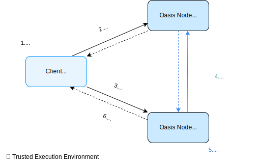

import DocCard from '@theme/DocCard';
import {findSidebarItem} from '@site/src/sidebarUtils';

# Guide

This page mainly describes the differences between Sapphire and Ethereum
since there are a number of excellent tutorials on developing for Ethereum.
If you don't know where to begin, the [Hardhat tutorial], [Solidity docs], and
[Emerald dApp tutorial] are great places to start. You can continue following
this guide once you've set up your development environment and have deployed
your contract to a non-confidential EVM network (e.g., Ropsten, Emerald).


[Hardhat tutorial]: https://hardhat.org/tutorial
[Solidity docs]: https://docs.soliditylang.org/en/v0.8.15/solidity-by-example.html
[Emerald dApp tutorial]: ../emerald/writing-dapps-on-emerald.mdx

## Oasis Consensus Layer and Sapphire ParaTime

The Oasis Network consists of the consensus layer and a number of ParaTimes.
ParaTimes are independent replicated state machines that settle transactions
using the consensus layer (to learn more, check the [Oasis Network Overview]
[overview chapter]). Sapphire is a ParaTime which implements the Ethereum
Virtual Machine (EVM).

The minimum and also expected block time in Sapphire is **6 seconds**. Any
Sapphire transaction will require at least this amount of time to be executed,
and probably no more.

ParaTimes, Sapphire included, are not allowed to directly access your tokens stored
in consensus layer accounts. You will need to _deposit_ tokens from your consensus
account to Sapphire. Consult the [How to transfer ROSE into an EVM ParaTime]
[how-to-deposit-rose] chapter to learn more.


[overview chapter]: ../../general/oasis-network/README.mdx
[how-to-deposit-rose]: ../../general/manage-tokens/how-to-transfer-rose-into-paratime.mdx
[Testnet faucet]: https://faucet.testnet.oasis.dev/

## Testnet and Mainnet

Sapphire is deployed on both Testnet and Mainnet. The Testnet should be
considered unstable software and may have its state wiped at any time. As
the name implies, only use the Testnet for testing unless you're testing how
angry your users get when state is wiped.

:::danger Never deploy production services on Testnet

Because Testnet state can be wiped in the future, you should **never** deploy a
production service on the Testnet! Just don't do it!

Also note that while the Testnet does use actual TEEs, due to experimental
software and different security parameters, **confidentiality of Sapphire on the
Testnet is not guaranteed** -- all transactions and state published on the
Sapphire Testnet should be considered public.

:::

:::tip

For testing purposes, visit our [Testnet faucet] to obtain some TEST which you
can then use on the Sapphire Testnet to pay for gas fees. The faucet supports
sending TEST both to your consensus layer address or to your address inside the
ParaTime.

:::

[network-parameters]: ../../node/mainnet/README.md
[Testnet]: ../../node/testnet/README.md

## Sapphire vs Ethereum

Sapphire is generally compatible with Ethereum, the EVM, and all of the
user and developer tooling that you already use. There are a few breaking changes,
but we think that you'll like them:

* Contract state is only visible to the contract that wrote it. With respect
  to the contract API, it's as if all state variables are declared as `private`, but
  with the further restriction that not even full nodes can read the values. Public or
  access-controlled values are provided instead through explicit getters.
* Transactions and calls are end-to-end encrypted into the contract. Only the caller
  and the contract can see the data sent to/received from the ParaTime. This ends up
  defeating most of the utility of block explorers, however.
* The `from` address using of calls is derived from a signature attached to the call.
  Unsigned calls have their sender set to the zero address. This allows contract authors
  to write getters that release secrets to authenticated callers, but without
  requiring a transaction to be posted on-chain.

In addition to confidentiality, you get a few extra benefits including the ability to generate private
entropy, and make signatures on-chain. An example of a dApp that uses both is a HSM contract
that generates an Ethereum wallet and signs transactions sent to it via transactions.

Otherwise Sapphire is like Emerald, which is like a fast, cheap Ethereum.

## Integrating Sapphire

Once ROSE tokens are [deposited into Sapphire], it should be painless for users to begin
using dApps. To achieve this ideal user experience, we have to modify the dApp a little,
but it's made simple by our compatibility library, [@oasisprotocol/sapphire-paratime].

There are compatibility layers in other languages, which may be found in [the repo].


[deposited into Sapphire]: ../../general/manage-tokens/how-to-transfer-rose-into-paratime.mdx
[@oasisprotocol/sapphire-paratime]: https://www.npmjs.com/package/@oasisprotocol/sapphire-paratime
[the repo]: https://github.com/oasisprotocol/sapphire-paratime/tree/main/clients

## Writing Secure dApps

### Wallets

Sapphire is compatible with popular self-custodial wallets including MetaMask,
Ledger, Brave, and so forth. You can also use libraries like Web3.js and Ethers
to create programmatic wallets. In general, if it generates secp256k1 signatures,
it'll work just fine.

### Languages & Frameworks

Sapphire is programmable using any language that targets the EVM, such as Solidity
and Vyper. If you prefer to use an Ethereum framework like Hardhat or Truffle, you
can also use those with Sapphire; all you need to do is set your Web3 gateway URL.
You can find the details of the Oasis Sapphire Web3 gateway
[here](/dapp/sapphire#web3-gateway).

### Transactions & Calls



The figure above illustrates the flow of a confidential smart contract
*transaction* executed on the Sapphire ParaTime.

Transactions and calls must be encrypted and signed for maximum security.
You can use the [@oasisprotocol/sapphire-paratime] JS package to make your life
easy. It'll handle cryptography and signing for you.

You should be aware that taking actions based on the value of private data may
leak the private data through side channels like time spent and gas use. If you
need to branch on private data, you should in most cases ensure that both
branches exhibit similar time/gas and storage patterns.

You can also make confidential smart contract *calls* on Sapphire. If you
use `msg.sender` for access control in your contract, the call **must be
signed**, otherwise `msg.sender` will be zeroed. On the other hand, set the
`from` address to all zeros, if you want to avoid annoying signature popups in
the user's wallet for calls that do not need to be signed. The JS library will
do this for you.

:::note

Inside the smart contract code, there is no way of knowing whether the
client's call data were originally encrypted or not.

:::

<details>
  <summary>Detailed confidential smart contract transaction flow on Sapphire</summary>
  <div>
    
  </div>
</details>

<details>
  <summary>Detailed confidential smart contract call flow on Sapphire</summary>
  <div>
    
  </div>
</details>

### Contract State

The Sapphire state model is like Ethereum's except for all state being encrypted
and not accessible to anyone except the contract. The contract, executing in an
active (attested) Oasis compute node is the only entity that can request its
state encryption key from the Oasis key manager. Both the keys and values of the
items stored in state are encrypted, but the size of either is *not* hidden. You
app may need to pad state items to a constant length, or use other obfuscation.
Observers may also be able to infer computation based on storage access patterns,
so you might need to obfuscate that, too.

Contract state may be made available to third parties through logs/events, or
explicit getters.

### Contract Logs

Contract logs/events (e.g., those emitted by the Solidity `emit` keyword)
are exactly like Ethereum. Data contained in events is *not* encrypted.
Precompiled contracts are available to help you encrypt data that you can
then pack into an event, however.

:::danger Unmodified contracts may leak state through logs

Base contracts like those provided by OpenZeppelin often emit logs containing
private information. If you don't know they're doing that, you might undermine
the confidentiality of your state. As a concrete example, the ERC-20 spec
requires implementers to emit an `event Transfer(from, to, amount)`, which is
obviously problematic if you're writing a confidential token. What you can
do instead is fork that contract and remove the offending emissions.

:::

## Running a Private Oasis Network Locally

For convenient development and testing of your dApps the Oasis team prepared
the [oasisprotocol/sapphire-dev][sapphire-dev] Docker image which brings you a
complete Oasis stack to your desktop. The Localnet Sapphire instance **mimics
confidential transactions**, but it does not run in the Trusted Execution
Environment nor does it require Intel's SGX on your computer. The network is
isolated from the Mainnet or Testnet and consists of:

- single Oasis validator node with 1-second block time and 30-second epoch,
- single Oasis client node,
- three compute nodes running Oasis Sapphire,
- single key manager node,
- PostgreSQL instance,
- Oasis Web3 gateway with transaction indexer and enabled Oasis RPCs,
- helper script which populates initial test accounts for you.

To run the image, execute:

```sh
docker run -it -p8545:8545 -p8546:8546 oasisprotocol/sapphire-dev
```

After a while, the tool will show you something like this:

```
sapphire-dev 2023-02-28-git84730b2 (oasis-core: 22.2.6, sapphire-paratime: 0.4.0, oasis-web3-gateway: 3.2.0-git84730b2)

Starting oasis-net-runner with sapphire...
Starting postgresql...
Starting oasis-web3-gateway...
Bootstrapping network and populating account(s) (this might take a minute)...

Available Accounts
==================
(0) 0x75eCF0d4496C2f10e4e9aF3D4d174576Ee9010E2 (100 ROSE)
(1) 0x903a7dce5a26a3f4DE2d157606c2191740Bc4BC9 (100 ROSE)
(2) 0xF149ad5CBFfD92ba84F5784106f6Cb071A32a1b8 (100 ROSE)
(3) 0x2315F40C1122400Df55483743B051D2997ef0a62 (100 ROSE)
(4) 0xf6FdcacbA93A428A07d27dacEf1fBF25E2C65B0F (100 ROSE)

Private Keys
==================
(0) 0x160f52faa5c0aecfa26c793424a04d53cbf23dcad5901ce15b50c2e85b9d6ca7
(1) 0x0ba685723b47d8e744b1b70a9bea9d4d968f60205385ae9de99865174c1af110
(2) 0xfa990cf0c22af455d2734c879a2a844ff99bd779b400bb0e2919758d1be284b5
(3) 0x3bf225ef73b1b56b03ceec8bb4dfb4830b662b073b312beb7e7fec3159b1bb4f
(4) 0xad0dd7ceb896fd5f5ddc76d56e54ee6d5c2a3ffeac7714d3ef544d3d6262512c

HD Wallet
==================
Mnemonic:       bench remain brave curve frozen verify dream margin alarm world repair innocent
Base HD Path:   m/44'/60'/0'/0/%d

WARNING: The chain is running in ephemeral mode. State will be lost after restart!

Listening on http://localhost:8545 and ws://localhost:8546
```

Those familiar with local dApp environments will find the output above similar
to `geth --dev` or `ganache-cli` commands or the `geth-dev-assistant` npm
package. [sapphire-dev] will spin up a private Oasis Network locally, generate
and populate test accounts and make the following Web3 endpoints available for
you to use:
- `http://localhost:8545`
- `ws://localhost:8546`

:::tip

If you prefer using the same mnemonics each time (e.g. for testing purposes)
or to populate just a single wallet, use `-to` flag and pass the mnemonics or
the wallet address. For example

```sh
docker run -it -p8545:8545 -p8546:8546 oasisprotocol/sapphire-dev -to "bench remain brave curve frozen verify dream margin alarm world repair innocent"
docker run -it -p8545:8545 -p8546:8546 oasisprotocol/sapphire-dev -to "0x75eCF0d4496C2f10e4e9aF3D4d174576Ee9010E2"
```

:::

:::danger

[sapphire-dev] runs in ephemeral mode. Any smart contract and wallet balance
will be lost after you quit the Docker container!

:::

[sapphire-dev]: https://hub.docker.com/r/oasisprotocol/sapphire-dev

## See also

<DocCard item={findSidebarItem('/node/run-your-node/paratime-client-node')} />
<DocCard item={findSidebarItem('/node/web3')} />
