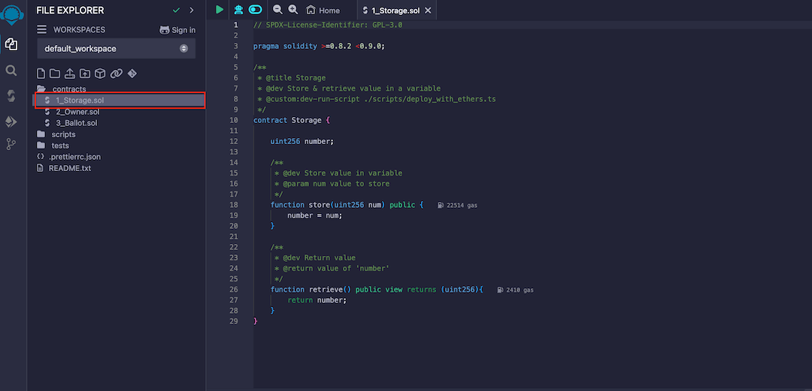
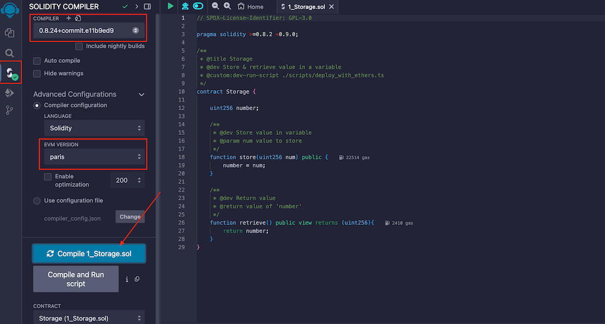
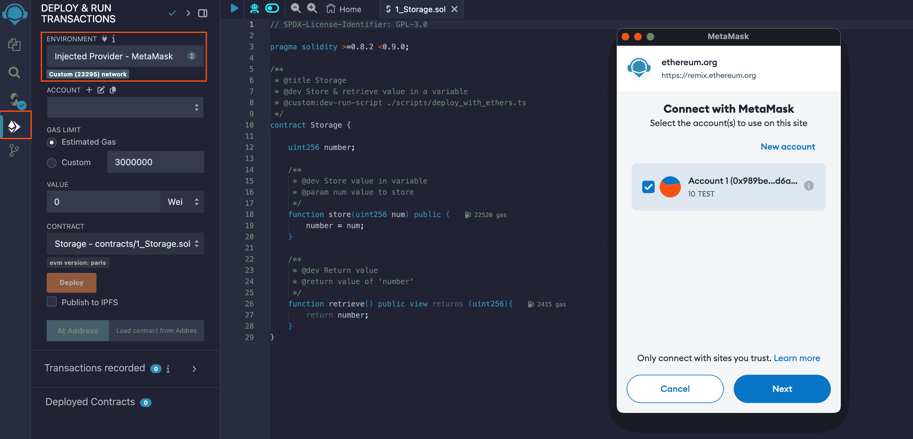
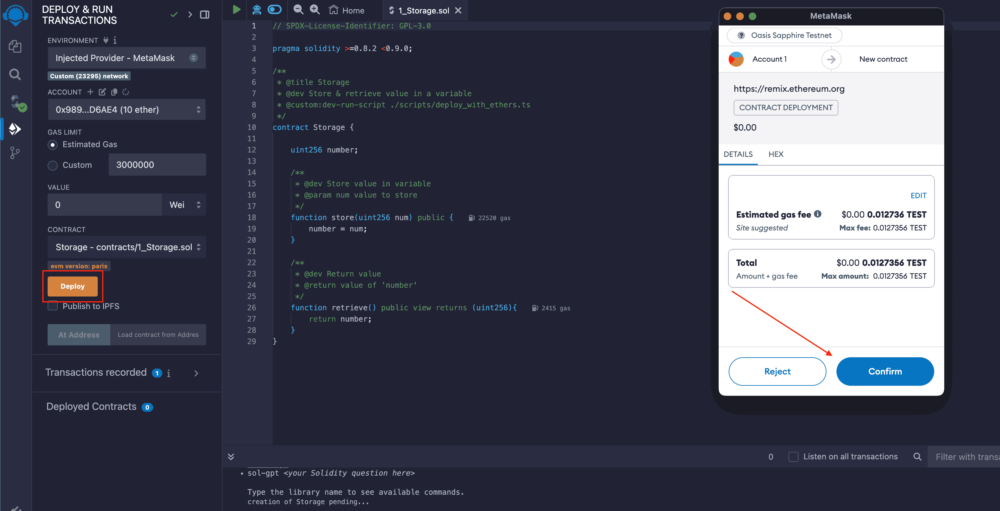
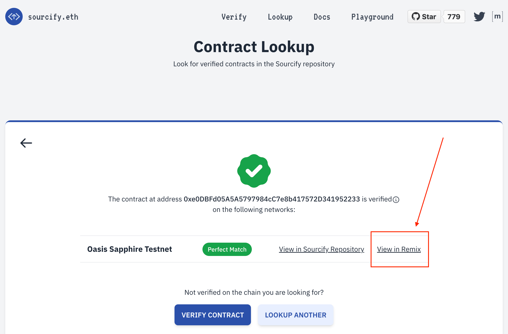

# Remix

## Intro

[Remix] is a popular web IDE for swift development, deployment and testing
smart contracts on the Ethereum Network. We will use it in combination with
MetaMask to access the network settings and your wallet to sign and submit the
transactions.

:::info

Refer to the [Remix documentation] for a deeper look of all functionality.

:::

## Setup

If you haven't done it yet, first [install the MetaMask extension for your
browser][metamask]. Add the Sapphire networks to your MetaMask, our
[network page] has handy `Add to MetaMask` buttons for this. If you wish to
connect to the Sapphire [localnet] container, configure the local network as
well.

When you open Remix for the first time, it automatically creates an example
project. Open the `contracts` folder and select the `1_Storage.sol` file.

## Compilation

Continue on the **Solidity Compiler** tab. Select the compiler version
**`0.8.24`**, under *advanced configuration* select the evm version **`paris`**
and after click `Compile 1_Storage.sol`

:::info Compiler Version

The Sapphire uses the [Rust Ethereum EVM][rust-evm]. This implementation is
compatible with Solidity versions up to **0.8.24**. However, it does not yet
support some transaction types introduced in Solidity **0.8.25**, such as those
mentioned in [rust-ethereum/evm#277][revm-277], which are pending release.

:::

:::info EVM Version

EVM versions after **paris** (shanghai and upwards) include the PUSH0 opcode which
isn't supported on Sapphire.

:::

[rust-evm]:https://github.com/rust-ethereum/evm
[revm-277]: https://github.com/rust-ethereum/evm/issues/277

## Deploying

Next, in the **Deploy and Run Transactions** tab, select the `Injected Web3`
environment. A MetaMask popup will appear and you will have to connect one or
more accounts with Remix. 

Once the connection succeeds, click on the `Deploy` button. The MetaMask popup
appears again and you will have to review the transaction and finally confirm
the transaction.

If everything goes well, your transaction will be deployed using the selected
account in the MetaMask and the corresponding Sapphire Network.

Congratulations! Now you can start developing your own smart contracts on
Oasis Sapphire! Should you have any questions, do not hesitate to
share them with us on the [#dev-central Discord channel][discord].

## Confidential Features

The transactions and queries send with Remix are unencrypted and unsigned.

## Sourcify integration

If you go on a verified contract on Sourcify, you can directly open it in in Remix.
This allows you to make contract calls with out the need of a deticated frontend.

:::info ABI-Playground

An alternattive way to make contract calls of Sapphire contracts is our
[ABI-Playground].

:::

[localnet]: ./localnet.mdx
[network page]: https://docs.oasis.io/dapp/sapphire/network#rpc-endpoints
[Remix]: https://remix.ethereum.org
[Remix documentation]: https://remix-ide.readthedocs.io/en/latest/
[metamask]: ../../general/manage-tokens/README.mdx#check-your-account
[discord]: https://oasis.io/discord
[ABI-Playground]: https://abi-playground.oasis.io/
