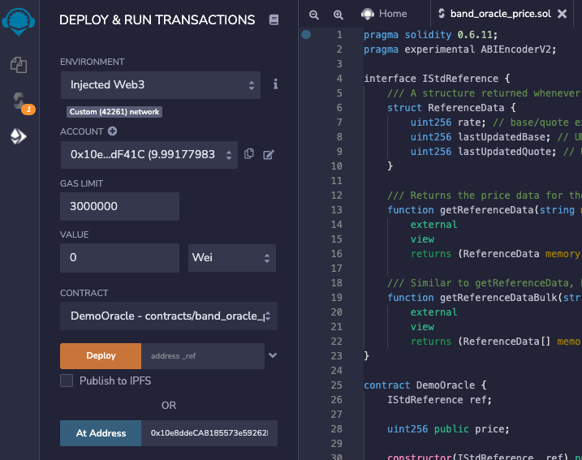

# Integrating BAND oracle smart contract

This guide will explain how to query the Band Protocol reference data smart
contract from another Solidity smart contract on Emerald.

### What is the Band Protocol?

[Band Protocol](https://bandprotocol.com) is a cross-chain data oracle
platform that aggregates and connects real-world data and APIs to smart
contracts. You can read more about the specific details of the protocol
[here](https://docs.bandchain.org).

### Deploy Oracle

1. Follow [this link][demooracle-remix] to Remix. The link contains an encoded example `DemoOracle.sol` contract.
2. Compile the contract with compiler version `0.6.11`.
3. Switch to the Deploy tab of Remix.
   1. Select "Injected Web3" in the Environment dropdown in the top left to connect Metamask.
   2. Make sure that Metamask is connected to the Emerald (Testnet/Mainnet) network. You can read about adding Emerald network to Metamask [here](../../manage-tokens/how-to-transfer-rose-into-evm-paratime.mdx#metamask).

4. Enter the Emerald Testnet Band reference data aggregator contract address (`0x61704EFB8b8120c03C210cAC5f5193BF8c80852a`) to the `DemoOracle` constructor and deploy the contract. You can access the reference data aggregator contract on mainnet at `0xDA7a001b254CD22e46d3eAB04d937489c93174C3`.

An interface to interact with the contract will appear in the bottom left corner of Remix.

### Get Rates

Clicking the `getPrice` button will return the current price of WBTC in USD. This function calls `getReferenceData(string memory _base, string memory _quote)` on the Band reference data contract, passing "WBTC" and "USD", indicating WBTC as the base and USD as the quote. The rate returned is base/quote multiplied by 1e18.

Note that the `DemoOracle` contract only returns the latest rate, but the reference contract also returns values of the last time the base and quote references were updated.

The price is offset by 1e18. The returned value at the time of testing is `39567000000000000000000`. Multiplying by 1e-18 gives the current USD price given by the reference contract, 39567.00 WBTC/USD.

Clicking the `getMultiPrices` button returns multiple quotes in the same call, WBTC/USD and ETH/USD in this case. This function calls `getReferenceDataBulk(string[] memory _bases, string[] memory _quotes)` on the Band reference data contract, passing "WBTC" and "ETH" as the base and "USD" for the quote. This will return the current WBTC and ETH prices in USD, as an array of integers. The call also returns just the exchange rates (multipilied by 1e18), but can be modified to return the last updated times for the bases and quotes.

The `savePrice` function will save any base/quote rate that is passed to it in the storage variable named `price`. This storage data will only be updated when the “savePrice” function is called, so the saved `price` value will go stale unless this function is called repeatedly.

### Mainnet Reference Data Contract

You can access the reference data aggregator contract on mainnet at [0xDA7a001b254CD22e46d3eAB04d937489c93174C3](https://explorer.emerald.oasis.dev/address/0xDA7a001b254CD22e46d3eAB04d937489c93174C3/transactions).

### Available Reference Data

You can view the available reference data on the [Band Standard Dataset site here](https://data.bandprotocol.com/).

### Example of DemoOracle.sol contract

[DemoOracle.sol contract example in Remix][demooracle-remix]

### Bandchain.js {#bandchain}

Band also has a javascript library that makes it easy to interact with BandChain directly from Javascript or Typescript applications. The library provides classes and methods for convenient to send transactions, query data, OBI encoding, and wallet management. You can read more about it [here](https://docs.bandchain.org/client-library/bandchain.js/getting-started.html).

[demooracle-remix]: https://remix.ethereum.org/?#code=cHJhZ21hIHNvbGlkaXR5IDAuNi4xMTsKcHJhZ21hIGV4cGVyaW1lbnRhbCBBQklFbmNvZGVyVjI7CgppbnRlcmZhY2UgSVN0ZFJlZmVyZW5jZSB7CiAgICAvLy8gQSBzdHJ1Y3R1cmUgcmV0dXJuZWQgd2hlbmV2ZXIgc29tZW9uZSByZXF1ZXN0cyBmb3Igc3RhbmRhcmQgcmVmZXJlbmNlIGRhdGEuCiAgICBzdHJ1Y3QgUmVmZXJlbmNlRGF0YSB7CiAgICAgICAgdWludDI1NiByYXRlOyAvLyBiYXNlL3F1b3RlIGV4Y2hhbmdlIHJhdGUsIG11bHRpcGxpZWQgYnkgMWUxOC4KICAgICAgICB1aW50MjU2IGxhc3RVcGRhdGVkQmFzZTsgLy8gVU5JWCBlcG9jaCBvZiB0aGUgbGFzdCB0aW1lIHdoZW4gYmFzZSBwcmljZSBnZXRzIHVwZGF0ZWQuCiAgICAgICAgdWludDI1NiBsYXN0VXBkYXRlZFF1b3RlOyAvLyBVTklYIGVwb2NoIG9mIHRoZSBsYXN0IHRpbWUgd2hlbiBxdW90ZSBwcmljZSBnZXRzIHVwZGF0ZWQuCiAgICB9CgogICAgLy8vIFJldHVybnMgdGhlIHByaWNlIGRhdGEgZm9yIHRoZSBnaXZlbiBiYXNlL3F1b3RlIHBhaXIuIFJldmVydCBpZiBub3QgYXZhaWxhYmxlLgogICAgZnVuY3Rpb24gZ2V0UmVmZXJlbmNlRGF0YShzdHJpbmcgbWVtb3J5IF9iYXNlLCBzdHJpbmcgbWVtb3J5IF9xdW90ZSkKICAgICAgICBleHRlcm5hbAogICAgICAgIHZpZXcKICAgICAgICByZXR1cm5zIChSZWZlcmVuY2VEYXRhIG1lbW9yeSk7CgogICAgLy8vIFNpbWlsYXIgdG8gZ2V0UmVmZXJlbmNlRGF0YSwgYnV0IHdpdGggbXVsdGlwbGUgYmFzZS9xdW90ZSBwYWlycyBhdCBvbmNlLgogICAgZnVuY3Rpb24gZ2V0UmVmZXJlbmNlRGF0YUJ1bGsoc3RyaW5nW10gbWVtb3J5IF9iYXNlcywgc3RyaW5nW10gbWVtb3J5IF9xdW90ZXMpCiAgICAgICAgZXh0ZXJuYWwKICAgICAgICB2aWV3CiAgICAgICAgcmV0dXJucyAoUmVmZXJlbmNlRGF0YVtdIG1lbW9yeSk7Cn0KCmNvbnRyYWN0IERlbW9PcmFjbGUgewogICAgSVN0ZFJlZmVyZW5jZSByZWY7CgogICAgdWludDI1NiBwdWJsaWMgcHJpY2U7CgogICAgY29uc3RydWN0b3IoSVN0ZFJlZmVyZW5jZSBfcmVmKSBwdWJsaWMgewogICAgICAgIHJlZiA9IF9yZWY7CiAgICB9CgogICAgZnVuY3Rpb24gZ2V0UHJpY2UoKSBleHRlcm5hbCB2aWV3IHJldHVybnMgKHVpbnQyNTYpewogICAgICAgIElTdGRSZWZlcmVuY2UuUmVmZXJlbmNlRGF0YSBtZW1vcnkgZGF0YSA9IHJlZi5nZXRSZWZlcmVuY2VEYXRhKCJXQlRDIiwiVVNEIik7CiAgICAgICAgcmV0dXJuIGRhdGEucmF0ZTsKICAgIH0KCiAgICBmdW5jdGlvbiBnZXRNdWx0aVByaWNlcygpIGV4dGVybmFsIHZpZXcgcmV0dXJucyAodWludDI1NltdIG1lbW9yeSl7CiAgICAgICAgc3RyaW5nW10gbWVtb3J5IGJhc2VTeW1ib2xzID0gbmV3IHN0cmluZ1tdKDIpOwogICAgICAgIGJhc2VTeW1ib2xzWzBdID0gIldCVEMiOwogICAgICAgIGJhc2VTeW1ib2xzWzFdID0gIkVUSCI7CgogICAgICAgIHN0cmluZ1tdIG1lbW9yeSBxdW90ZVN5bWJvbHMgPSBuZXcgc3RyaW5nW10oMik7CiAgICAgICAgcXVvdGVTeW1ib2xzWzBdID0gIlVTRCI7CiAgICAgICAgcXVvdGVTeW1ib2xzWzFdID0gIlVTRCI7CiAgICAgICAgSVN0ZFJlZmVyZW5jZS5SZWZlcmVuY2VEYXRhW10gbWVtb3J5IGRhdGEgPSByZWYuZ2V0UmVmZXJlbmNlRGF0YUJ1bGsoYmFzZVN5bWJvbHMscXVvdGVTeW1ib2xzKTsKCiAgICAgICAgdWludDI1NltdIG1lbW9yeSBwcmljZXMgPSBuZXcgdWludDI1NltdKDIpOwogICAgICAgIHByaWNlc1swXSA9IGRhdGFbMF0ucmF0ZTsKICAgICAgICBwcmljZXNbMV0gPSBkYXRhWzFdLnJhdGU7CgogICAgICAgIHJldHVybiBwcmljZXM7CiAgICB9CgogICAgZnVuY3Rpb24gc2F2ZVByaWNlKHN0cmluZyBtZW1vcnkgYmFzZSwgc3RyaW5nIG1lbW9yeSBxdW90ZSkgZXh0ZXJuYWwgewogICAgICAgIElTdGRSZWZlcmVuY2UuUmVmZXJlbmNlRGF0YSBtZW1vcnkgZGF0YSA9IHJlZi5nZXRSZWZlcmVuY2VEYXRhKGJhc2UscXVvdGUpOwogICAgICAgIHByaWNlID0gZGF0YS5yYXRlOwogICAgfQp9Cg==
