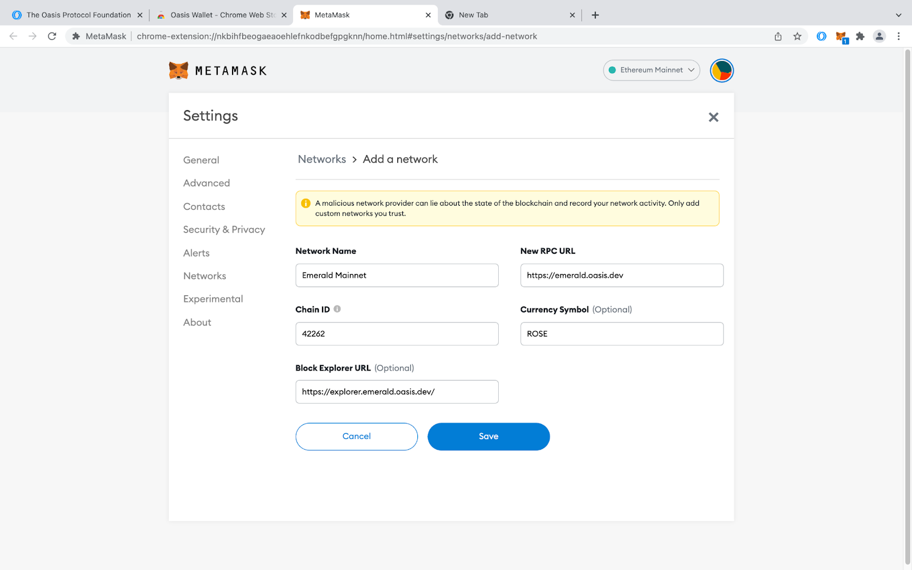
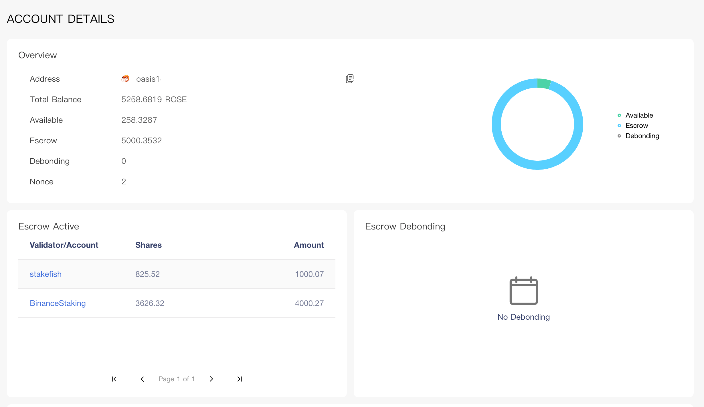

# Manage your Tokens

The **native token** on Oasis Mainnet is called **ROSE**. Native tokens are used
for:

- proof-of-stake **block proposal and validation**,
- **governance proposal voting**,
- paying out **staking rewards**,
- paying **network gas fees**,
- dApp-specific use cases.

:::tip ROSE App - The quickest way into the Oasis Ecosystem

The Oasis team built a **[ROSE App][rose-move]** for you to easily **move ROSE**
from a crypto exchange to Sapphire and the other way around. This way you
can quickly and safely start using your tokens with Sapphire dApps without
diving into mechanics of the Oasis ParaTime deposits and withdrawals! You simply
need a working [Metamask/Ethereum compatible wallet](#metamask).

    <iframe style={{margin: 'auto', display:'block', border:"none"}} width="560" height="380" src="https://www.youtube-nocookie.com/embed/2AEBhbArV0k" title="How to Deposit &amp; Withdraw on ROSE App" allow="accelerometer; autoplay; clipboard-write; encrypted-media; gyroscope; picture-in-picture; web-share" allowFullScreen></iframe>

:::

## ROSE and the ParaTimes

The [Oasis Network architecture] separates between the **consensus** and the
**compute** (a.k.a. ParaTime) layer. The consensus layer and each ParaTime
running on the compute layer have their own **ledger** containing, among other
data, the **balances of the accounts**.

Moving tokens from the consensus layer to a ParaTime is called a **deposit** and
moving them from a ParaTime back to the consensus layer is a **withdrawal** (see
[ADR-3] for technical specifications).

You can **transfer** tokens from your account to another account only, if both
accounts are either on the consensus layer or inside the same ParaTime.

Besides moving the tokens across layers and accounts, you can also **[delegate
tokens]** to a validator and **earn passive income** as a reward.

[delegate tokens]: staking-and-delegating.md
[ADR-3]: ../../adrs/0003-consensus-runtime-token-transfer.md
[Oasis Network architecture]: ../oasis-network/README.mdx

## Get ROSE

### From a Centralized Exchange via ROSE App

The most common way to obtain ROSE is by buying it on a centralized
[crypto exchange] (Binance, Coinbase, etc.). 
**Most exchanges only operate on the Oasis consensus layer**.
This means that you can deposit and withdraw ROSE from an exchange only to
**your consensus account**. To address this, the Oasis team built a simple
**[ROSE App][rose-move]** tool that quickly and safely **moves funds from the consensus
account derived from your [Ethereum-compatible wallet](#metamask) to Sapphire**
and the other way around.

[crypto exchange]: https://en.wikipedia.org/wiki/Cryptocurrency_exchange

1.  **Open the ROSE App Move interface:** Visit
    [**rose.oasis.io/move**][rose-move] in a web browser.

2.  **Connect Your Wallet:** Click **"Connect Wallet"** and sign in with your
    EVM wallet (e.g. MetaMask with Oasis Sapphire network). The app will prompt
    you to select or unlock your wallet.

3.  **Choose the destination:** Click **Select and sign-in** on the left card
    to move ROSE to Oasis Sapphire. The app will prompt you to sign-in.

4.  **Copy Deposit Address:** The app will display the a **Oasis Consensus Layer
    address** for your withdrawal. **Copy this address.** (It will be a
    oasis1… style address).

5.  **Withdraw from the Exchange:** Now go to your exchange account and initiate
    a **withdrawal of ROSE**. When asked for a destination address, paste the
    **Oasis Consensus Layer address** you copied in the previous step.
    **Note:** MEXC supports direct Sapphire withdrawal (0x…). Binance/Coinbase
    only support consensus layer (oasis1…).

5.  **Confirm the Transfer:** Complete withdrawal on the exchange.

6.  **ROSE Arrives on Sapphire:** ROSE will appear in your Sapphire wallet.

:::info
If your exchange only supports withdrawal to the **Oasis mainnet
(consensus)**, an alternative is to withdraw to your Oasis **consensus-layer
ROSE wallet** (a bech32 address managed in the [ROSE Wallet][rose-wallet]).
Once you have the ROSE in your consensus account, follow the
[From Oasis Consensus (Mainnet ROSE)](#from-oasis-consensus-mainnet-rose) guide
below.
:::

### From BNB Chain (Bridging wROSE)

**[Decentralized exchanges] (DEX) running on Sapphire** are also gaining pace.
In this case, the payout is made from the DEX directly to **your account on
Sapphire**, and you can use a standard [Ethereum-compatible wallet](#metamask).

For **wROSE on BNB Chain**, use cBridge:

1.  In the **cBridge** interface, set **BNB Chain** as the source and **Oasis
    Sapphire** as the destination .

2.  Select **wROSE** from the token list (this is the wrapped ROSE token on BNB
    Chain) .

3.  Enter the amount of wROSE to bridge and initiate the transfer. Approve and
    confirm the transaction in your BSC or MetaMask wallet.

4.  After a few minutes, the ROSE will appear in your Sapphire address.

[Decentralized exchanges]: https://en.wikipedia.org/wiki/Decentralized_finance#Decentralized_exchanges

### From Oasis Consensus (Mainnet ROSE)

Alternatively, you can use a fully-featured [ROSE
Wallet](#official-non-custodial-wallets) to **create a consensus account** and
then **deposit ROSE** from that account to your Sapphire one.

*   In the **Oasis Wallet extension** or web wallet, go to the **ParaTimes**
    section.

*   Select **"Deposit to ParaTime"**, then choose **Sapphire**.

*   Enter your **Sapphire EVM address** (0x… from MetaMask) as the recipient,
    and the amount of ROSE to deposit .

*   Confirm the transaction to receive ROSE on Sapphire.

For detailed instructions with screenshots, see our
[onboarding guide][onboarding].

[onboarding]: https://oasis.net/blog/onboarding-guide-rose-sapphire

## The Wallets

To sign the token-related transactions such as transfers, deposits, withdrawals
and delegations described above, you need a **private key** tied to the
corresponding account. Your keys are stored in *[crypto wallets]*.

[crypto wallets]: https://en.wikipedia.org/wiki/Cryptocurrency_wallet

:::caution

For your own security and peace of mind, please only use the wallets that are
listed here. **Using unofficial wallets can result in the permanent loss of your
ROSE!**

:::

### Official Non-Custodial Wallets

The Oasis team developed the following **non-custodial wallets** for you. This
means that the keys for managing the tokens are **stored on your device** such
as a laptop or a mobile phone, and **you are responsible to keep it safe**:

- **[ROSE Wallet - Web]**: Runs as a web application in your web browser, the
  private keys are encrypted with a password and stored inside your Browser's
  local store.

- **[ROSE Wallet - Browser extension]**: Runs as an extension to your
  Chrome-based browser, the private keys are encrypted with a password and
  stored inside your Browser's encrypted store.

- **[Oasis CLI]**: Command line tool, suitable for builders on Oasis,
  automation, the private keys are encrypted by a password and stored inside
  your home folder.

[ROSE Wallet - Web]: oasis-wallets/web.mdx
[ROSE Wallet - Browser extension]: oasis-wallets/browser-extension.mdx
[Oasis CLI]: ../../build/tools/cli/README.md

### MetaMask

[MetaMask] is probably the best-known crypto wallet. However, it is an
**EVM-compatible** wallet. This means **you can only use it to check the account
balances and sign transactions on Sapphire and Emerald chains**. You cannot use
it, for example, to sign **consensus layer transactions** or perform
**deposits** and **withdrawals** to and from ParaTimes.

You can add the Sapphire RPC endpoint by clicking on the "Add to MetaMask"
button next to your preferred Mainnet endpoint provider in the [Sapphire]
chapter.

[MetaMask]: https://metamask.io/download/
[Sapphire]: ../../build/sapphire/network.mdx#rpc-endpoints

### Ledger

The wallets above are just carefully programmed computer programs that store
your keys (in an encrypted form) somewhere on your disk and then use them to
sign the transactions. However, if your device gets infected with a piece of
malicious software (malware, keyloggers, screen captures), **the password to
decrypt your private keys may be obtained and your private keys stolen**.

To mitigate such attacks, a **hardware wallet** should be used. This is a
physical device which stores your private key and which is only accessed when
you send the hardware wallet a transaction to be signed. The transaction content
is then shown on the hardware wallet screen for a user to verify and if the
user agrees, the transaction is signed and sent back to your computer or your
mobile phone for submission to the network. The Oasis team **integrated support
for Ledger hardware wallets into all ROSE wallets and the Oasis CLI**. Check out
a special [Ledger chapter][Ledger] to learn how to install the Oasis nano app
on your Ledger device.

[Ledger]: holding-rose-tokens/ledger-wallet.md

### Custodial Services

It is up to you to pick the right strategy for keeping the private key of your
account holding your tokens safe. Some users may decide to trust their tokens to
a **custody provider**. You can read more about those in the
[Custody providers][custody-providers] chapter.

[custody-providers]: holding-rose-tokens/custody-providers.md

## Account Formats and Signature Schemes

Transactions on the consensus layer must be signed using the **ed25519
signature scheme**. The addresses on the consensus layer use the
**[Bech-32 encoding]**, and you can recognize them by a typical `oasis1` prefix.

ParaTimes can implement arbitrary signature schemes and address encodings. For
example, since the Sapphire and Emerald ParaTimes are EVM-compatible, they
implement the **secp256k1** scheme and prefer the **hex-encoded**
addresses and private keys starting with `0x`.

The table below summarizes the current state of the address formats, signature
schemes and compatible wallets.

| Consensus or ParaTime | Address Format | Digital Signature Scheme    | Supported Wallets                                                                                                                                                                                |
|-----------------------|----------------|-----------------------------|--------------------------------------------------------------------------------------------------------------------------------------------------------------------------------------------------|
| Consensus             | `oasis1`       | ed25519                     | <ul><li>ROSE Wallet - Web</li><li>ROSE Wallet - Browser Extension</li><li>Oasis CLI</li></ul>                                                                                                    |
| Sapphire              | `0x`, `oasis1` | secp256k1, ed25519, sr25519 | <ul><li>Metamask and other EVM-compatible wallets (transfers only)</li><li>ROSE Wallet - Browser Extension</li><li>ROSE Wallet - Web (deposits and withdrawals only)</li><li>Oasis CLI</li></ul> |
| Cipher                | `oasis1`       | secp256k1, ed25519, sr25519 | <ul><li>Oasis CLI</li></ul>                                                                                                                                                                      |
| Emerald               | `0x`, `oasis1` | secp256k1, ed25519, sr25519 | <ul><li>Metamask and other EVM-compatible wallets (transfers only)</li><li>ROSE Wallet - Browser Extension</li><li>ROSE Wallet - Web (deposits and withdrawals only)</li><li>Oasis CLI</li></ul> |

[Bech-32 encoding]: https://github.com/bitcoin/bips/blob/master/bip-0173.mediawiki#bech32

## Check your account

To check the balance of your consensus account, you can use the
[Oasis Scan](https://www.oasisscan.com) block explorer. Enter your `oasis1`
address at the top and hit enter. For example:

The "Amount" is a sum of three values:

- the "Available" tokens that can immediately be transferred,
- the "Escrow" tokens that are delegated,
- the "Reclaim" tokens that are waiting for the debonding period to pass.

To check the account's deposits and withdrawals navigate to "Transactions" pane
and press "ParaTime" on the right side, next to the "Consensus" button.
You will see all ParaTime-related transactions including deposits, withdrawals,
transfers and even smart contract transactions.

Furthermore, you can view the transaction details, if you click on a
transaction's "Tx Hash". Among others, you will see the transaction type, the
"from", "to" and "amount" fields.

:::info

Be aware that the [Oasis Scan Blockchain Explorer](https://www.oasisscan.com)
is built for consensus layer. If you want to explore Sapphire (0x addresses,
Token Transfers, Contract Calls, etc.), you have to use the
[Sapphire Blockchain Explorer](https://explorer.oasis.io/mainnet/sapphire).

:::

[rose-move]: https://rose.oasis.io/move
