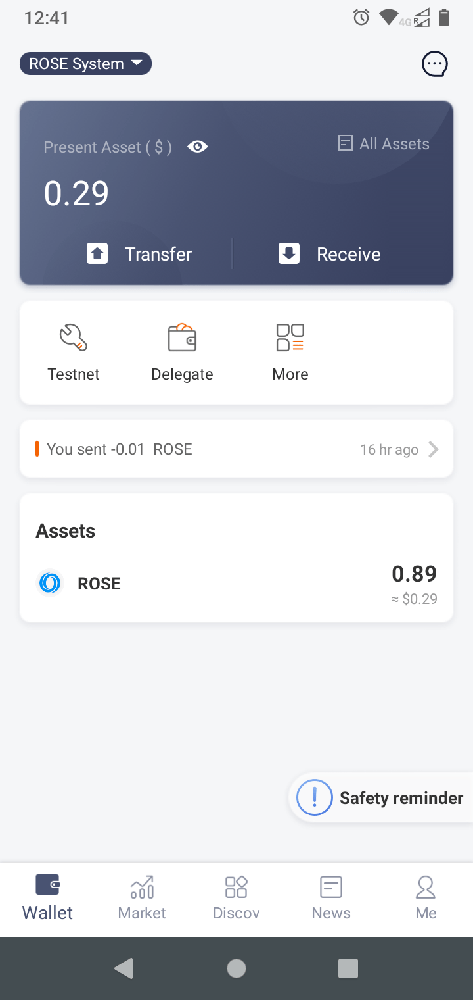
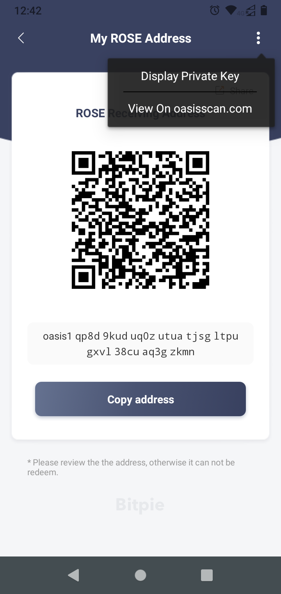

# Frequently Asked Questions

This documents answers frequently asked questions about Oasis Wallets and 3rd
party wallets & custody providers supporting ROSE tokens.

### How can I transfer ROSE tokens from my [BitPie wallet](holding-rose-tokens/bitpie-wallet.md) to my Oasis Wallet?

:::caution

BitPie wallet doesn't use the standardized account key generation process specified in [ADR 0008](../../adrs/0008-standard-account-key-generation.md). Consequently, your **Bitpie wallet's mnemonic phrase will not open the same account in Oasis Wallet**.

:::

The **preferred way** is to create a new wallet with an Oasis Wallet and transfer the tokens to this new address using your BitPie wallet. The cost (i.e. transaction fee) should be negligible.

If your tokens are staked/delegated, then you need to debond them first which will take approximately 14 days. Afterwards, you can transfer them to the new Oasis Wallet address and stake/delegate them via an Oasis Wallet again.

**Alternatively** however, if you do not want to transfer the tokens over the network, you can export the private key from your BitPie wallet and import it in Oasis Wallet in 2 steps:

1. [Export your BitPie wallet's Oasis account private key](faq.md#how-can-i-export-my-bitpie-wallets-oasis-account-private-key)
2. [Open your Oasis wallet via exported private key in Oasis Wallet - Web](../../general/manage-tokens/oasis-wallets/web.md#open-wallet-via-private-key)

### How can I export my [BitPie wallet](holding-rose-tokens/bitpie-wallet.md)'s Oasis account private key?

On the main BitPie wallet screen, click on the "Receive" button.



The QR code with your ROSE address will appear. Then, in the top right corner, tap on the kebab menu "⋮" and select "Display Private Key"_._



BitPie wallet will now ask you to enter your PIN to access the private key.

Finally, your account's private key will be shown to you encoded in Base64 format (e.g. `YgwGOfrHG1TVWSZBs8WM4w0BUjLmsbk7Gqgd7IGeHfSqdbeQokEhFEJxtc3kVQ4KqkdZTuD0bY7LOlhdEKevaQ==`) which you can [import into Oasis Wallet](oasis-wallets/web.md#access-an-existing-wallet).

### Chromium under Ubuntu does not recognize my Ledger device. What is the problem?

First check that you added the Ledger udev device descriptors as mentioned in the [Linux installation guide](https://support.ledger.com/hc/en-us/articles/4404389606417-Download-and-install-Ledger-Live). Next, check that your Ledger wallet is recognized by the [Oasis Core Ledger tool](../../oasis-core-ledger/usage/address.md). You should see something like this:

```bash
$ oasis-core-ledger show_address
oasis1qp8d9kuduq0zutuatjsgltpugxvl38cuaq3gzkmn
Ensure account address shown on device's screen matches the outputted address.
```

If all of the above works, then the issue is most likely that Chromium does not have the permission to access your Ledger device. Starting with Ubuntu 20.04 the Chromium browser is installed via snap package by default. Snap is more convenient for upstream developers to deploy their software and it also adds additional layer of security by using apparmor. In our case however, it prevents Chromium to access arbitrary USB devices with WebUSB API including your Ledger device. A workaround for this issue is to install Chromium natively using the official [Chormium beta PPA](https://launchpad.net/\~saiarcot895/+archive/ubuntu/chromium-beta) or the official [Google Chrome .deb package](https://dl.google.com/linux/direct/google-chrome-stable_current_amd64.deb).

### Are Ethereum and Oasis wallets that different? I can use the same mnemonics with both, right?

Yes, both Oasis and Ethereum wallets make use of the mnemonics as defined in [BIP39](https://github.com/bitcoin/bips/blob/master/bip-0039.mediawiki) and they even use the same wordlist to derive the keypairs for your wallet. However, they use a different **signature scheme and a derivation path**, so the addresses and the private keys are incompatible.

Here's a task for you:

1. Visit [https://iancoleman.io/bip39/](https://iancoleman.io/bip39/) to generate a BIP39 mnemonic.
2. Select ETH token and copy the hex-encoded private key of the first derived account, for example `0xab2c4f3bc70d40f12f6030750fe452448b5464114cbfc46704edeef2cd06da74`.
3. Import the Ethereum-compatible account with the private key obtained above to your Oasis Wallet Browser Extension.
4. Notice the Ethereum address of the account, for example `0x58c72Eb040Dd0DF10882aA87a39851c21Ae5F331`.
5. Now in the Account management screen, select this account and click on the "Export private key" button. Confirm the risk warning.
6. You will notice the private key of the Ethereum-compatible account, the hex-encoded address and the very same address encoded in the Oasis Bech32 format, in our case `oasis1qpaj6hznytpvyvalmsdg8vw5fzlpftpw7g7ku0h0`.
7. Now let's use the private key from step 2 to import the Oasis wallet with. First, convert the hex-encoded key to base64 format, for example by using [this service](https://base64.guru/converter/encode/hex). In our example, that would be `qyxPO8cNQPEvYDB1D+RSRItUZBFMv8RnBO3u8s0G2nQ=`.
8. Next, import this base64-encoded private key to the Oasis Wallet Browser Extension.
9. You should see your newly imported account and the Oasis address. In our case `oasis1qzaf9zd8rlmchywmkkqmy00wrczstugfxu9q09ng`.
10. Observe that this account address is different than the Bech32-encoded version of the Ethereum-compatible address despite using the same private key to import the wallet with, because of a different _signature scheme_.

As an additional exercise, you can also create an Oasis wallet using the BIP39 mnemonic from the step 1 above. You will notice that the imported account's base64-encoded private key in the account details screen is different from the one in step 7 above. That's because Oasis uses a different _derivation path_ than Ethereum.

### Which derivation path should I use on Ledger? ADR 0008 or Legacy? {#ledger-derivation-paths}

To convert your mnemonic phrase into a private key for signing trasactions,
each wallet (hardware or software) performs a *key derivation*. The Oasis
Protocol Foundation standardized the key derivation for official Oasis wallets
in a document called [ADR 0008] back in January 2021. However, the Ledger
hardware wallet already supported signing transactions at that time using a
custom (we now call it *legacy*) derivation path which is incompatible with
the one defined in ADR 0008. Later, in Oasis app for Ledger v2.3.1 support for
ADR 0008 was added so the wallet can request either derivation from the Ledger
device.

The key derivation path defined in ADR 0008 has the following advantages
compared to the legacy one:

- Derivation path is shorter which results in approximately twice as fast
  key derivation (and transaction signing) without compromising security.
- In case your Ledger device is broken or lost and you are unable to retrieve
  a new one, you will be able to import your Ledger mnemonic and restore your
  private key in any Oasis wallet which implements ADR 0008.

For reasons above, we recommend the usage of ADR 0008. However, since there are
no security considerations at stake, Oasis wallets will support legacy
derivation on Ledger for the foreseeable future.

:::danger

If you happen to import your Ledger mnemonic to a software wallet, consider
that mnemonic *potentially exposed/compromised*, i.e. not appropriate for a
hardware wallet mnemonic anymore. If you use a new hardware wallet in the
future, **never restore it from the mnemonic that was previously used by any
software wallet!**

:::

[ADR 0008]: /adrs/0008-standard-account-key-generation

### The wallet gives me _Invalid keyphrase_ error when importing my wallet from mnemonics. How do I solve it?

Please check that:

* All mnemonics were spelled correctly. Oasis Wallets use English mnemonic phrase words as defined in BIP39. You can find a complete list of valid phrase words [here](https://github.com/bitcoin/bips/blob/master/bip-0039/english.txt).
* The mnemonics were input in correct order.
* All mnemonics were provided. The keyphrase should be either 12, 15, 18, 21, or 24 words long.

If you checked all of the above and the keyphrase still cannot be imported, please contact Oasis support.

### I imported my wallet with mnemonics. The wallet should contain funds, but the balance is empty. What can I do?

First, check your wallet address. If the address equals the one that you expected your funds on, then the key derivation from mnemonics worked correctly. Make sure you have a working internet connection so that the wallet can fetch the latest balance. Then check that the correct network (Mainnet or Testnet) is selected. These are completely separated networks and although the wallet address can be the same, the transactions and consequently the balances may differ. Finally, there might be a temporary problem with the [Oasis Monitor service](https://oasismonitor.com) itself which observes the network and indexes transactions. Oasis Wallets rely on that service and once it is back up and running, you should be able to see the correct balance.

If your wallet address is different than the one you used to transfer your funds to, then you used one of the wallets that don't implement the standardized key derivation path defined in [ADR 0008](../../adrs/0008-standard-account-key-generation.md). If you were using the BitPie wallet see [this question](faq.md#how-can-i-export-my-bitpie-wallets-oasis-account-private-key). Ledger hardware wallet users should refer to [this question](faq.md#how-can-i-use-my-oasis-wallet-mnemonics-in-ledger).

If you still cannot access your funds, please contact Oasis support.

### I sent my ROSE to BinanceStaking address.  Are they staked? Are they lost? What can I do?

If you just make a **Send** transaction to BinanceStaking address `oasis1qqekv2ymgzmd8j2s2u7g0hhc7e77e654kvwqtjwm` then your ROSE coins are not staked. They are now owned by BinanceStaking, which means they are not lost but only owned and managed by them. In this case, you should contact Binance via their [Support Center](https://www.binance.com/en/support) or [Submit a request](https://www.binance.com/en/chat).

:::info

Sending ROSE is different than staking it! With the staking transaction you **lend** your ROSE to the chosen validator and you are rewarded for that. **Sending** your ROSE to the receiving address you enter means that only the person who owns the private key (e.g. mnemonics) of that receiving address can manage these tokens and no one else. To learn more, read the [Staking and Delegating chapter](staking-and-delegating.md).

:::

### I withdrew ROSE from Emerald to an exchange (Binance, KuCoin), but my deposit is not there. What should I do?

Withdrawals from Emerald are slightly different from regular `staking.Transfer` transactions used to send ROSE on the consensus layer. If you withdrew your ROSE directly to an exchange and you were not funded there, contact the exchange support and provide them the link to your account on the [Oasis Scan](https://www.oasisscan.com) where they can verify all transactions. To learn more about this issue, read the [How to Transfer ROSE to ParaTime section](how-to-transfer-rose-into-paratime.mdx).
