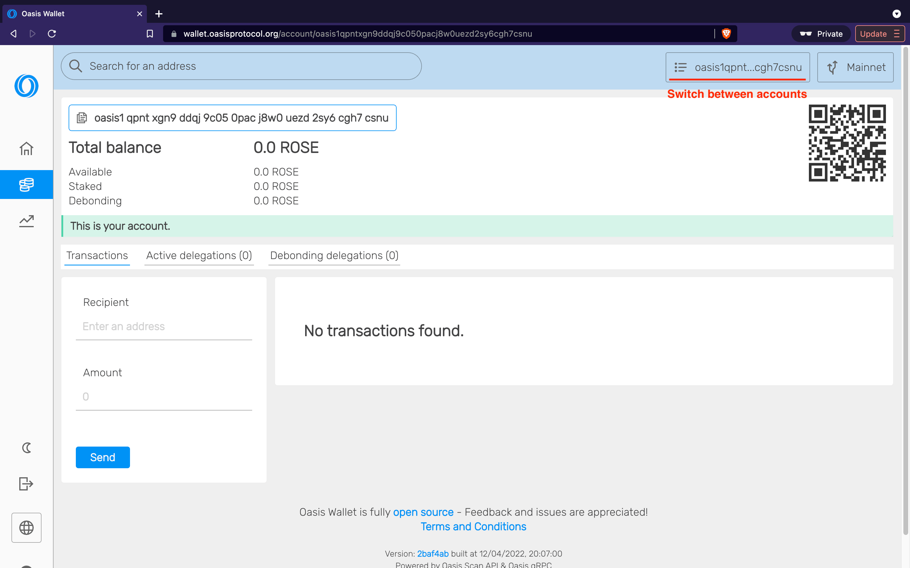
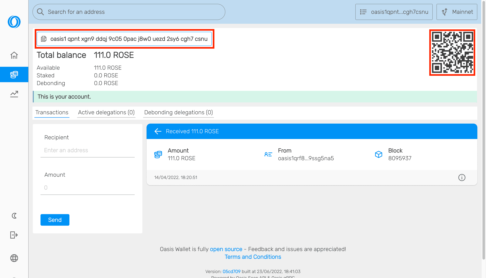
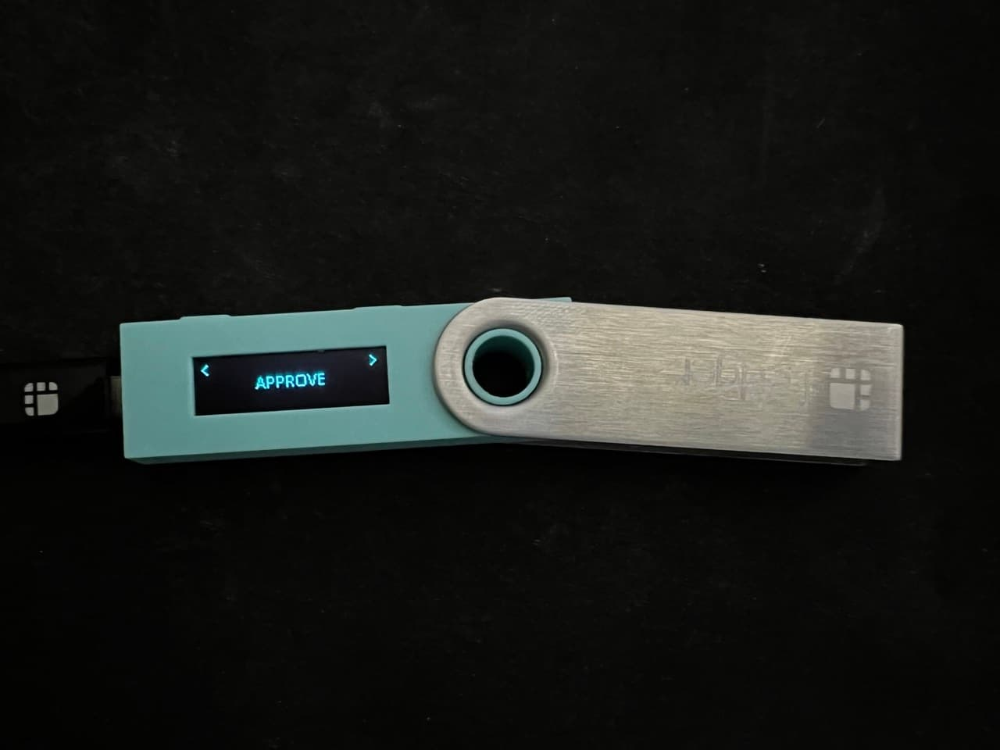

# Self-Custody With Ledger Hardware Wallet

This is a general documentation that will help users setup [Ledger] hadware
wallets with Oasis Network. Ledger Live software doesn't support Oasis (ROSE)
tokens natively yet. In this guide we will install Oasis app via Ledger Live to
open and access wallet with one or multiple accounts via our official
[Oasis Wallet - Web].

## Setup your Ledger device and Install Oasis App

1. To use your [Ledger] wallet to hold your ROSE tokens, you will have to
install [Oasis app] on your Ledger wallet via [Ledger Live]'s Manager. You need
to connect your Ledger to your device and unlock it with your PIN code first.

:::caution

The Oasis app requires an up-to-date firmware on your Ledger wallet:

* At least [version 2.0.0] released on Oct 21, 2021 on a Nano X device.
* At least [version 2.1.0] released on Nov 30, 2021 on a Nano S device.
* At least [version 1.0.4] released on Sep 27, 2022 on a Nano S Plus device.

Follow Ledger's instructions for updating the firmware on your Ledger wallet:

* [Nano X]
* [Nano S]
* [Nano S Plus]

:::

2. To find the Oasis app in the Ledger Live App catalog, you need to Allow
Ledger Manager on your Ledger device first, then you will be able to click App
catalog and search for _Oasis_:

3. Install _Oasis_ app

4. After the installation is completed, take your Ledger device, navigate to _Oasis_
app and use both buttons to open the app. Your Ledger device is ready
when you will see _"Oasis Ready"_ message.

The Oasis app will use the [BIP 39] mnemonic seed stored secretly on your
Ledger hardware wallet to generate the private & public key pairs for your
Oasis accounts. Make sure you backed up the mnemonic when you first initialized
your Ledger device!

## Manage Your Tokens

### Using Oasis Wallets

This is a simpler option since it allows you to connect to your Ledger wallet
via a web application or a browser extension.

In the example below we will use Oasis Wallet - Web. To learn more about other
features of the Oasis Wallets, please read the [Oasis Wallets] doc.

1. Navigate to [wallet.oasis.io] and click on the _Open wallet_ button.
Then, click on _Ledger_ when asked how to open your wallet.

2. In the next step, click on the _Select accounts to open_ button. Your
browser will open a pop-up window where you will have to select your Ledger
device. Finally, click on _Connect_.

:::caution

This step requires that your Ledger shows the _Oasis Ready_ message. After a
while your device may lock for safety reasons and you will need to unlock it to
perform this and subsequent steps.

:::

3. After connecting your Ledger to Oasis Wallet - Web another pop-up will appear
where you can choose to open one or more `oasis1` accounts derived from the seed
stored on your Ledger.

4. The account from your Ledger device is now opened. If you import multiple
accounts, you can switch between them by clicking on the account address in
the top-right corner.
Our demo account is empty.

5. Now you can use your Ledger to receive, send or delegate ROSE.
In this example, we have received 111 ROSE to our Ledger account.

#### Receive ROSE

Once you have successfully opened your Oasis account from Ledger, 
you can start receiving ROSE by sharing your account address.

You can simply copy your opened account address or scan QR code.

#### Send ROSE

To send your ROSE from your Oasis Ledger account to another Oasis consensus 
address, you have to follow these steps:

1. Enter destination consensus address into Recipient field, Enter amount
of ROSE you want to send and Click on Send button.

2. Then a pop-up window will appear where you need to Confirm transaction.

3. On your Ledger device carefully review transaction details and make sure they
match the ones on your computer. Navigate to the screen where you will see the
APPROVE button. Use the two buttons to approve your transaction.

4. You can verify if ROSE were successfully sent by checking latest transactions
or opening the receiving account.

### Using Oasis CLI Tools

This is a more powerful option that allows performing not just token-related
tasks (sending, staking, ParaTime deposits and withdrawals), but also generating
and/or signing raw transactions, multi-signatures, network governance
operations etc.

Ledger is supported by the Oasis CLI. Follow the instructions in the
[Oasis CLI Tools] page to learn more.

[Ledger]: https://www.ledger.com
[Oasis Wallet - Web]: https://www.ledger.com
[Oasis app]: https://github.com/Zondax/ledger-oasis
[Ledger Live]: https://www.ledger.com/ledger-live/
[wallet.oasis.io]: https://wallet.oasis.io
[version 2.0.0]: https://support.ledger.com/hc/en-us/articles/360014980580-Ledger-Nano-X-firmware-release-notes
[version 2.1.0]: https://support.ledger.com/hc/en-us/articles/360010446000-Ledger-Nano-S-firmware-release-notes
[version 1.0.4]: https://support.ledger.com/hc/en-us/articles/4494540771997-Ledger-Nano-S-Plus-Firmware-Release-Notes
[Nano X]: https://support.ledger.com/hc/en-us/articles/360013349800
[Nano S]: https://support.ledger.com/hc/en-us/articles/360002731113-Update-Ledger-Nano-S-firmware
[Nano S Plus]: https://support.ledger.com/hc/en-us/articles/4445777839901-Update-Ledger-Nano-S-Plus-firmware
[BIP 39]: https://github.com/bitcoin/bips/blob/master/bip-0039.mediawiki
[Oasis Wallets]: ../oasis-wallets/README.mdx
[Oasis CLI Tools]: ../advanced/oasis-cli-tools/README.md
