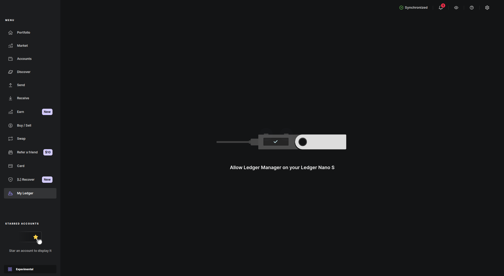

# Ledger Hardware Wallet

This is a general documentation that will help users setup the [Ledger] hadware
wallet on the Oasis Network. Ledger Live doesn't support Oasis (ROSE)
tokens natively yet. In this guide we will install Oasis app via Ledger Live to
open and access wallet with one or multiple accounts via our official
[ROSE Wallet - Web][wallet.oasis.io].

## Setup your Ledger device and Install Oasis App

1. To use your [Ledger] wallet to hold your ROSE tokens, you will have to
   install [Oasis app] on your Ledger wallet via [Ledger Live]'s Manager. Click
   on the "My Ledger" button. Then, you need to connect your Ledger to your
   computer and unlock it with your PIN code.

   

   :::caution

   The Oasis app requires an up-to-date firmware on your Ledger wallet:

   * At least [version 2.0.0] released on Oct 21, 2021 on a Nano X device.
   * At least [version 2.1.0] released on Nov 30, 2021 on a Nano S device.
   * At least [version 1.0.4] released on Sep 27, 2022 on a Nano S Plus device.
   * At least [version 1.4.0] released on Apr 29, 2024 on a Stax device.
   * At least [version 1.1.1] released on Jul 26, 2024 on a Flex device.

   Follow Ledger's instructions for updating the firmware on your Ledger wallet:

   * [Nano X]
   * [Nano S]
   * [Nano S Plus]
   * [Stax]
   * [Flex]

   :::

2. Next, allow the Ledger Manager on your Ledger device. Then you will be able
   to open the App catalog and search for `oasis`:

   
   

3. Install the **Oasis** Nano app.

   

4. After the installation is complete, take your Ledger device, navigate to the
   Oasis app and use both buttons to open it. Your Ledger device is ready when
   you will see the "Oasis Ready" message.

   

The Oasis app will use the [BIP 39] mnemonic seed stored secretly on your
Ledger hardware wallet to generate the private & public key pairs for your
Oasis accounts. **Make sure you backed up the mnemonic when you first
initialized your Ledger device!**

:::tip

For security, the ROSE Wallet uses a **different mnemonic to private key
derivation path** by default for your Ledger accounts (known as *Ledger* or
*ed25519-legacy*) and for the accounts stored on a disk or inside a browser
(also known as [ADR-8]). If you find yourself in a situation where your Ledger
device does not function anymore, you have the backup mnemonic available, and
you urgently need to access your funds, use the *[Oasis unmnemonic tool][unmnemonic-tool]* to
**derive the private key from your Ledger mnemonic**. Checkout out this
[FAQ section][unmnemonic-tool-faq] to download it and learn more.

:::

[ADR-8]: ../../../adrs/0008-standard-account-key-generation.md
[unmnemonic-tool]: https://github.com/oasisprotocol/tools/tree/main/unmnemonic
[unmnemonic-tool-faq]: ../faq.mdx#i-lost-my-ledger-or-my-ledger-is-broken-i-urgently-need-to-access-my-assets-can-i-import-ledger-mnemonic-into-rose-wallet

## Connect to your wallet

### ROSE Wallet

This is a simpler option since it offers a nice UI for connecting your Ledger to
a web application or a browser extension. Check out the following sections
corresponding to your wallet for instructions:

- [ROSE Wallet - Web: Import Ledger account](../oasis-wallets/web.mdx#import-an-existing-account)
- [ROSE Wallet - Browser extension: Ledger](../oasis-wallets/browser-extension.mdx#import-an-existing-account)

:::note

At time of writing, signing the ParaTime transactions is not yet supported by
the ROSE Wallet - Web or the Browser extension.

:::

### Oasis CLI

This is a more powerful option that allows performing not just token-related
tasks (transferring, staking, ParaTime deposits, withdrawals and transfers), but
also generating and/or signing raw transactions, multi-signatures, network
governance operations etc.

Ledger is supported by the [Oasis CLI] out of the box. You can add a new Ledger
account to the Oasis CLI by invoking the [`oasis wallet create`] command and
adding the `--kind ledger` parameter. For
example:

## Signing the transaction

Once your Ledger account is registered to the wallet on your computer, you can
use it to sign the transactions. After confirming the transaction on your
computer, the transaction details **will appear on your Ledger screen**
where you will need to **carefully review transaction details and make sure they
match the ones on your computer**. Then, navigate to the screen where you will
see the "APPROVE" button. Use the two buttons to approve your transaction.

The signed transaction will be sent back to your computer and submitted to the
network.

[Ledger]: https://www.ledger.com
[Oasis app]: https://github.com/Zondax/ledger-oasis
[Ledger Live]: https://www.ledger.com/ledger-live/
[wallet.oasis.io]: https://wallet.oasis.io
[version 2.0.0]: https://support.ledger.com/article/360014980580-zd
[version 2.1.0]: https://support.ledger.com/article/360010446000-zd
[version 1.0.4]: https://support.ledger.com/article/4494540771997-zd
[version 1.4.0]: https://support.ledger.com/article/Ledger-Stax-OS-release-notes
[version 1.1.1]: https://support.ledger.com/article/Ledger-Flex-OS-release
[Nano X]: https://support.ledger.com/article/360013349800-zd
[Nano S]: https://support.ledger.com/article/360013349800-zd
[Nano S Plus]: https://support.ledger.com/article/360013349800-zd
[Stax]: https://support.ledger.com/article/360013349800-zd
[Flex]: https://support.ledger.com/article/360013349800-zd
[BIP 39]: https://github.com/bitcoin/bips/blob/master/bip-0039.mediawiki
[Oasis CLI]: ../../../build/tools/cli/README.md
[`oasis wallet create`]: ../../../build/tools/cli/wallet.md#create
