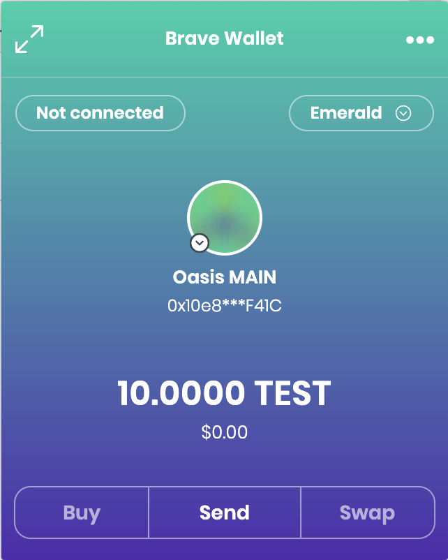
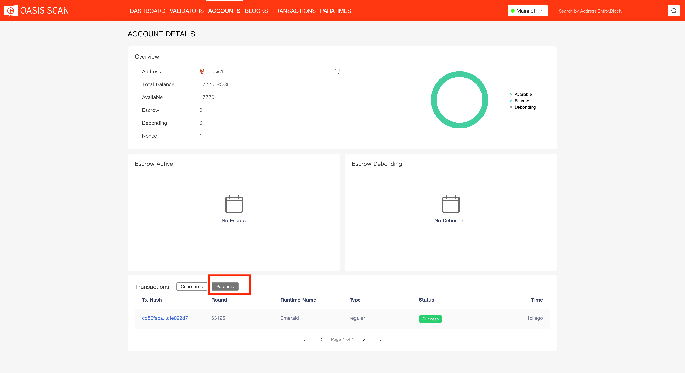

import DocCard from '@theme/DocCard';
import {findSidebarItem} from '@site/src/sidebarUtils';

# How to Transfer ROSE into an EVM ParaTime

This guide will walk you through transferring ROSE tokens from an Oasis
Consensus layer account into the Emerald ParaTime using the Oasis Wallet -
Browser Extension.

## About

An EVM-compatible ParaTime is one that integrates the Oasis Runtime SDK's EVM module, and,
as a result, behaves in most ways like Ethereum.
Currently, there are two such ParaTimes: [Emerald](../developer-resources/emerald-paratime/README.mdx) and [Sapphire](../developer-resources/sapphire-paratime/README.mdx).

An EVM-compatible ParaTime hosts EVM accounts in its own independent chain state, which means
that ROSE held at the consensus layer is not the same as the EVM paratime's token. Fortunately,
you can easily swap between the two by making _deposits_ and _withdrawals_.
These procedures are described in detail in [ADR 0003](/adrs/0003-consensus-runtime-token-transfer).

The _deposit_ procedure will first approve the ParaTime to access your specified amount of ROSE. Then, a `Deposit` transaction will be executed inside the ParaTime and tokens will be transferred from your consensus layer account to the ParaTime. If that transaction succeeds, the ParaTime will update the state of your provided EVM account to reflect the deposit of tokens. Emerald and Sapphire will both give you 1 e/sROSE for each consensus ROSE, although other ParaTimes may implement different rules.

The _withdraw_ procedure executes the `Withdraw` transaction inside the ParaTime which transfers the ROSE on the consensus layer from the ParaTime to the provided `oasis1` address. If the transaction succeeds, the ParaTime will update your EVM account state (usually by burning the tokens inside the ParaTime).

Currently, the Oasis Wallet Browser Extension is the only graphical user interface for performing deposits/withdrawals to/from ParaTimes.

## Managing your EVM account with Oasis Wallet Browser Extension

First, install the Oasis Wallet Browser extension. Next, restore your existing Oasis wallet or create a new by following the [Oasis Wallet Browser Extension chapter](oasis-wallets/browser-extension.md#create-a-new-wallet).

Once done, you will see your balance on the **Oasis consensus layer**. Next, we will import your Ethereum wallet to be used in the EVM ParaTime.

### Importing Ethereum wallet account

In the top-right corner, click your account icon to open the Account management menu.

Click "Import" and select "Ethereum-compatible Private Key" to import your existing Ethereum Account address.

:::info

We assume that you already have your Ethereum keypair. If you don’t have one yet, please go and create one. Store your Private Key, because you will need it in the Oasis Wallet Browser Extension.

:::

Fill in the "Account name" that will appear later in the Account Management screen.

Next, paste your hex-encoded Ethereum private key.

:::caution

You will need to import **the** **private key and** **not the mnemonics**. You can derive a private key from the mnemonics with BIP39->BIP44 converter. For example by using the [Ian Cole's tool](https://github.com/iancoleman/bip39/releases) offline.

:::

Your newly imported Ethereum account will appear under the "Ethereum-compatible Account" section in the Account Management screen. Check that the Ethereum address shown at the bottom matches the address that was shown to you when you generated the Ethereum key.

:::danger

In older versions of the Oasis Wallet Browser Extension there was also a bech32-encoded version of the Ethereum address shown in the Ethereum-compatible wallet. This address is only used internally for setting the allowance policy on the Oasis network. **If you encounter this, you should immediately update your Wallet Extension! The bech32-encoded address of the Ethereum-compatible account must never be used for transferring ROSE to. The signature schemes are incompatible (ECDSA versus ed25519) and those tokens would not be accessible anymore!**

:::

### Depositing ROSE to an EVM ParaTime

Now, you can transfer your ROSE to the EVM ParaTime. Navigate to the "ParaTimes" tab.
For the sake of demonstration, we'll continue with the Emerald ParaTime, but the
Sapphire ParaTime or any other EVM ParaTime works just as well.

Under Emerald click on the "To ParaTime" button.

Fill in the the "Amount" of ROSE that you want to transfer to Emerald and your **Ethereum-compatible address** in the "To" field you imported/created before. Then, click "Next", review and confirm the transaction.

:::info

At the time of writing, depositing and withdrawing ROSE to and from ParaTimes works for Oasis wallets **imported from the private key or the mnemonic only**. Support for the Ledger hardware wallet is not implemented yet.

:::

### Verifying ROSE balance on an EVM ParaTime

If everything went well, your entered amount of ROSE was sent to the Ethereum-compatible address in Emerald. Let's verify that your ROSE safely arrived on your Emerald Ethereum wallet.

#### Wallet Browser Extension

You can check the balance in the Oasis Wallet extension by opening the "Account Management" tab and selecting your Ethereum-compatible account to which you sent ROSE. Then click on the back arrow and navigate to the "ParaTimes" tab. Under Emerald you will notice the available amount of your ROSE.

#### Metamask

You can verify your balance in [Metamask](https://metamask.io) (or a built-in wallet in the Brave browser). First, install the extension in your favorite browser and add the Emerald Mainnet/Testnet by pointing your wallet at the Web3 gateway with parameters listed [here](../developer-resources/emerald-paratime/README.mdx#web3-gateway) (Sapphire parameters can be found [here](../developer-resources/sapphire-paratime/README.mdx#web3-gateway)). Then, import your Ethereum keypair and your balance should immediately be visible.

:::info

Brave wallet network configuration requires you to enter Chain's currency decimals for ROSE: 18)

:::

### Withdrawing ROSE from an EVM ParaTime

You can withdraw your ROSE from Emerald back to your Oasis wallet by first selecting your Ethereum-compatible account in the Account Management screen. Next, switch to ParaTimes tab and click on the "To Consensus" button near the Emerald entry. Fill in the "Amount" and your bech32-encoded Oasis wallet address and confirm the withdrawal. In a few moments you will have your ROSE accessible on the consensus layer.

:::danger

If you want to transfer ROSE to an exchange and you currently have them deposited on Emerald ParaTime, **we strongly recommend that you withdraw ROSE to your Oasis wallet first and then perform a regular token transfer to your Oasis address on the exchange!** The ParaTime's withdrawal procedure involves a number of steps as described in the introduction and some exchanges may not recognize this transaction as a valid transaction for funding your account on the exchange.

:::

:::info

Advanced users (e.g. those running Emerald or Sapphire ParaTime [compute nodes](/operators/set-up-your-node/run-a-paratime-node)) may need to withdraw ROSE stored in their `oasis1` account. Oasis Wallet Browser Extension does not support such withdrawals. Read the [Oasis CLI Deposit/Withdraw Tokens to/from ParaTime chapter](advanced/oasis-cli-tools/deposit-withdraw-tokens-to-from-paratime.mdx) to learn how to use Oasis CLI instead.

:::

### Verifying EVM ParaTime deposits and withdrawals

To verify and validate your transactions (deposits, withdrawals) on Emerald you can use our official [Oasis Scan](https://www.oasisscan.com) block explorer. Enter your oasis1 address and press Search. Then navigate to Transactions section and press "ParaTime" button next to Consensus. You will be able to see all transactions made from Ethereum compatible address (`0x`) you used in Emerald to your Consensus (`oasis1`) address where you sent your ROSE to.

Furthermore, you can click on Tx Hash of any transaction you see on the list. You will find your **from** Ethereum-compatible address, your **to** destination Consensus address, and **amount** of ROSE transferred.

:::info

Be aware that the [Oasis Scan Blockchain Explorer](https://www.oasisscan.com) is built for Consensus layer. If you want to explore Emerald ParaTime (0x addresses, Token Transfers, Contract Calls, etc.), you have to use [Emerald Blockchain Explorer](https://explorer.emerald.oasis.dev).

:::

## See also

<DocCard item={
    findSidebarItem('developer-resources/emerald-paratime/writing-dapps-on-emerald')
} />
<DocCard item={
    findSidebarItem('developer-resources/sapphire-paratime/writing-dapps-on-sapphire')
} />
