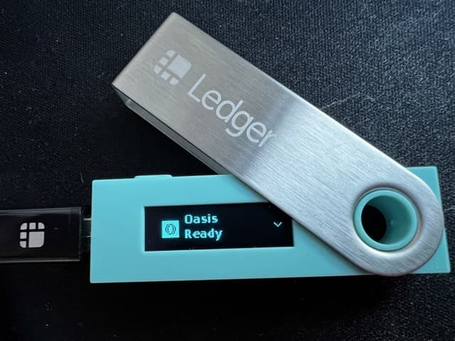
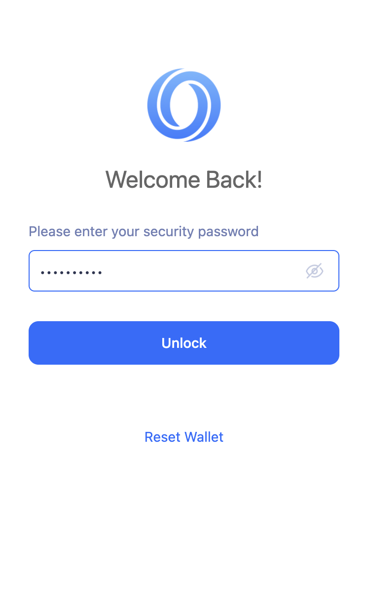
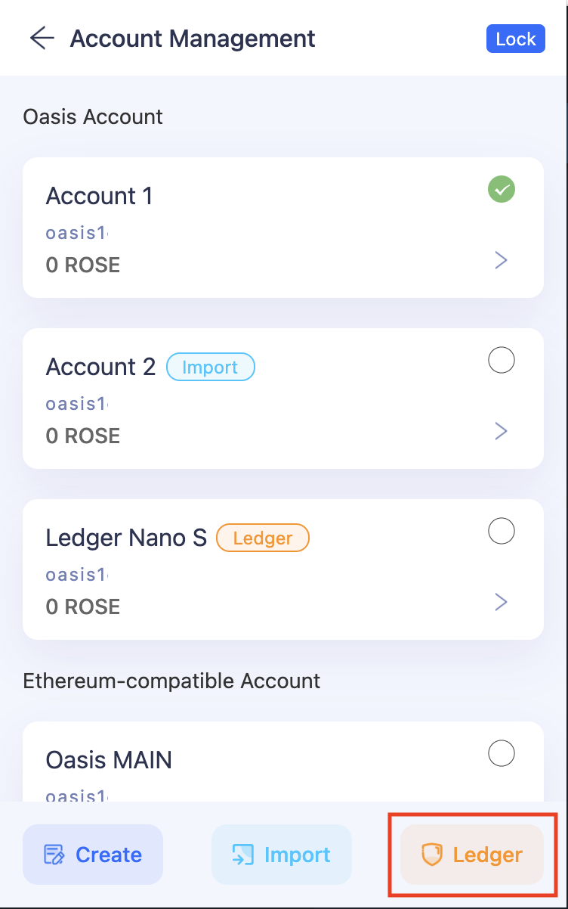
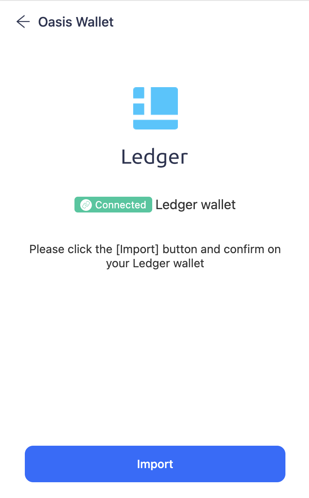
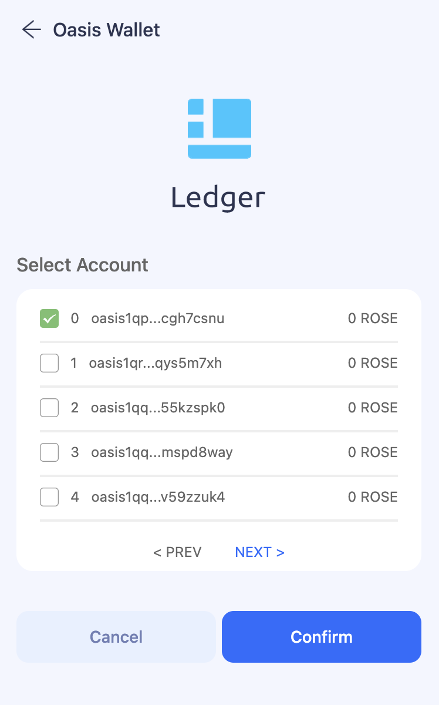

# Browser Extension

## **How to use the Oasis Wallet - Browser Extension**

:::info

Currently, [Oasis Wallet - Browser Extension](https://github.com/oasisprotocol/oasis-wallet-ext) **only supports** [**Chrome**](https://www.google.com/chrome/) or other [Chromium](https://www.chromium.org/Home)-based browsers.

:::

### Install the Oasis Wallet via Chrome Web Store

You can install the [Oasis Wallet - Browser Extension](https://github.com/oasisprotocol/oasis-wallet-ext) by heading to the [Chrome Web Store](https://chrome.google.com/webstore/detail/oasis-wallet/ppdadbejkmjnefldpcdjhnkpbjkikoip).

### Create a new wallet

:::caution

Your mnemonic phrase is required to access your wallet. Be sure to store it in a secure location. If you lose or forget your mnemonic phrase, you will lose access to your wallet and any token funds contained in it.

:::

:::caution

Never share your keyphrase. Anyone with your keyphrase can access your wallet and your tokens.

:::

### **Access an existing wallet**

### Send tokens

1. Click the avatar on the top right corner
2. Pick an account you want to transfer tokens out of
3. Click ‘Send’
4. Type in the token amount under ‘Amount’
5. Type in the Receiver’s wallet address
6. Click ‘Next’
7. Check the ‘Send Details’; if everything looks good to you, click ‘Confirm’
8. Wait for a couple of seconds, and you’ll get a status update of your transaction
9. Go back to the Account page, and you’ll see the transfer has gone through

### **Receive tokens**

Click ‘Receive’ on the Account page, and you’ll get the QR code as well as the wallet address in text format

### **Stake and delegate tokens**

1. Click ‘Staking’ on the Account main page
2. Go to ‘Validator node’, and select a node you want to delegate your tokens to.
3. Click into the node you want to delegate your tokens to, and click ‘Add Escrow’
4. Fill in the amount you want to delegate under ‘Amount’ and click ‘Next’
5. Check the ‘Delegate info, if everything looks good to you, click ‘Confirm’
6. Go to ‘My delegate’ and you will see which node you just delegated tokens to and by how much

### **Use an Account on your Ledger Wallet**

1. Plug your Ledger device into your computer and log into the Oasis app on-device

2. Open the Oasis Chrome Extension Wallet and click the account icon on the top right

3. Select Ledger on the bottom right of the app

4. Follow user onboarding flow clicking "Next" as you move forward with set up.

5. You'll see a pop-up in your Chrome Browser asking you to select  which device to connect. Click on your Ledger device. Then click "Connect". _NOTE: You may need to resize the pop up window to see all buttons._

6. Follow the next onboarding steps to upload the correct Ledger account, clicking "Confirm" when complete.

7. Use your Ledger to send, receive and stake on the Oasis Network!
