import Tabs from '@theme/Tabs';
import TabItem from '@theme/TabItem';

# ROSE Wallet - Browser Extension

## Installation

:::info

Currently, the [ROSE Wallet - Browser Extension](https://github.com/oasisprotocol/oasis-wallet-ext)
**only supports** [**Chrome**](https://www.google.com/chrome/) or other
[Chromium](https://www.chromium.org/Home)-based browsers.

:::

You can install the ROSE Wallet - Browser Extension by heading to the
[Chrome Web Store](https://chrome.google.com/webstore/detail/oasis-wallet/ppdadbejkmjnefldpcdjhnkpbjkikoip).

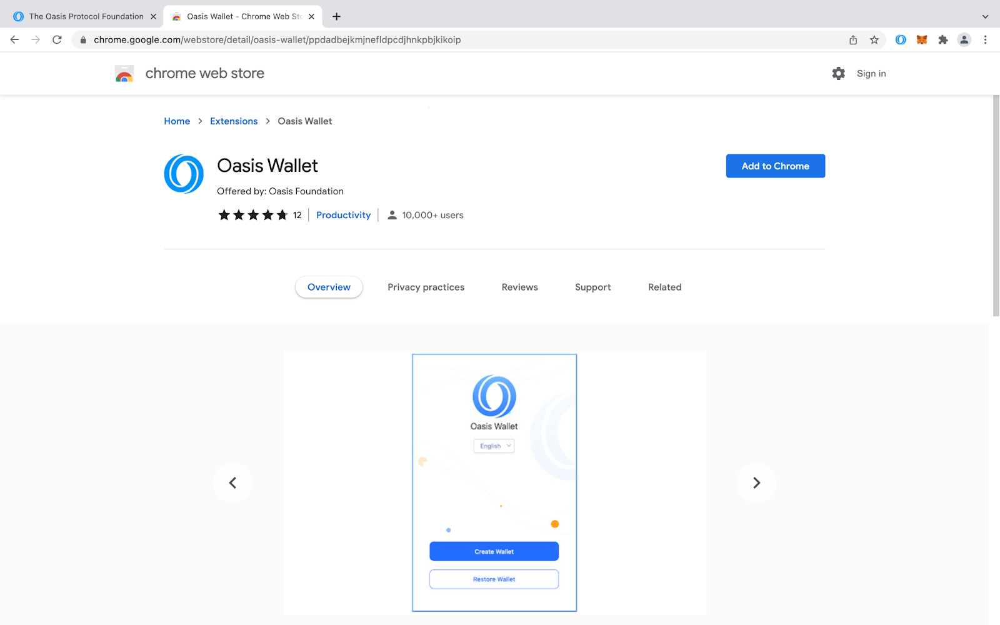

Next, either [create a new wallet](#create-a-new-account) or
[restore your existing one](#import-an-existing-account).

## Create a New Account

Enter the **new wallet password**. You will need to enter this password each
time you open the wallet and after some time when the wallet automatically
locks. Click "Next".

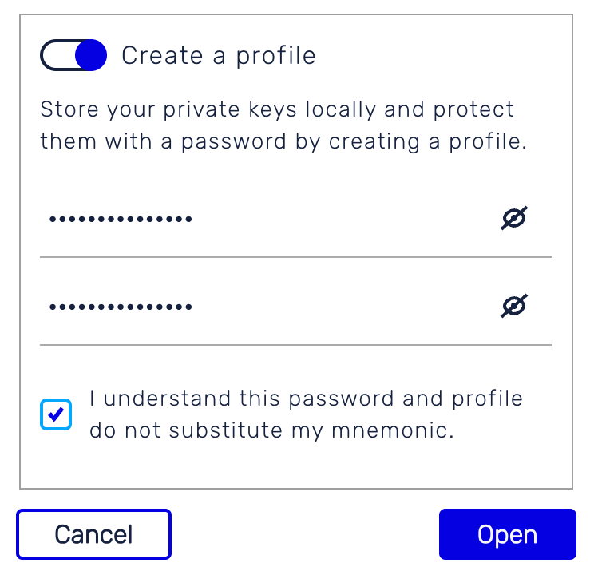

The newly generated mnemonic is shown to you. Carefully back it up. You will
need this mnemonic, to migrate the wallet to another device or to restore it, if
you uninstall your web browser. Click on the "Confirm backup" button.

:::caution

Your mnemonic phrase is required to access your wallet. Be sure to **store it in
a secure location**. If you lose or forget your mnemonic phrase, you will lose
access to your wallet and any token funds contained in it.

:::

:::danger

**Never share your mnemonic keyphrase**. Anyone with your keyphrase can access
your wallet and your tokens.

:::

Now reenter the mnemonic words as a proof that you backed up the mnemonic and
click on the "Confirm" button. Once done, you will see your balance on the
**Oasis consensus layer**.

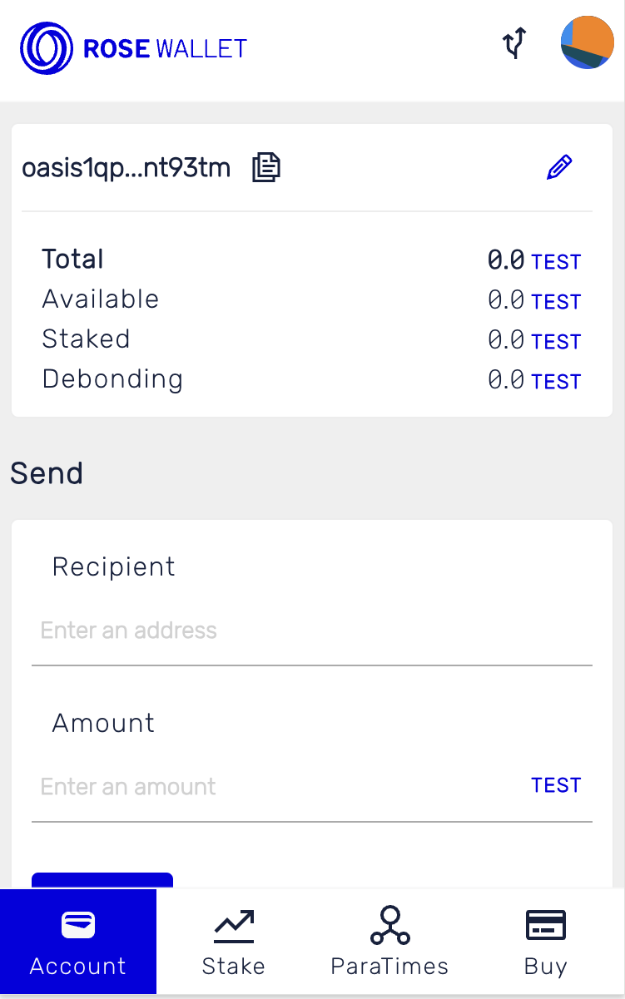

## Import an Existing Account

In the top-right corner, click your account icon to open the Account management
menu.

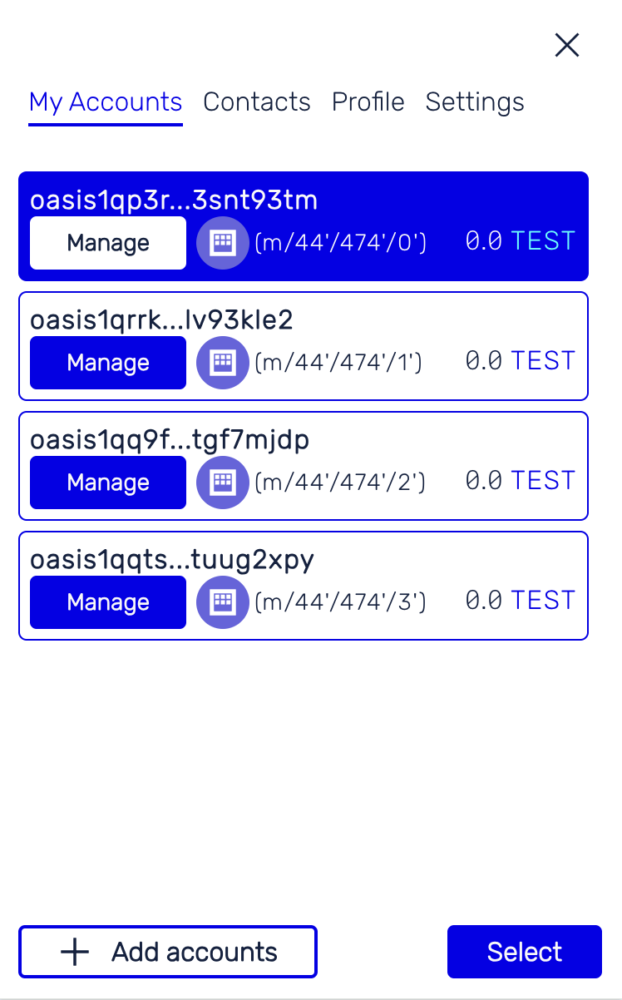

Click "Import" and select the:

- "Oasis Private Key" to import your existing Oasis private key to be used by
  Cipher ParaTime; or
- "Ethereum-compatible Private Key" to import your existing Ethereum Account to
  be used by the EVM-compatible Sapphire or Emerald.

:::info

We assume that you already have your public/private keypair. If you don’t have
one yet, please go and create one. Store your Private Key, because you will
need it in the ROSE Wallet - Browser Extension.

:::

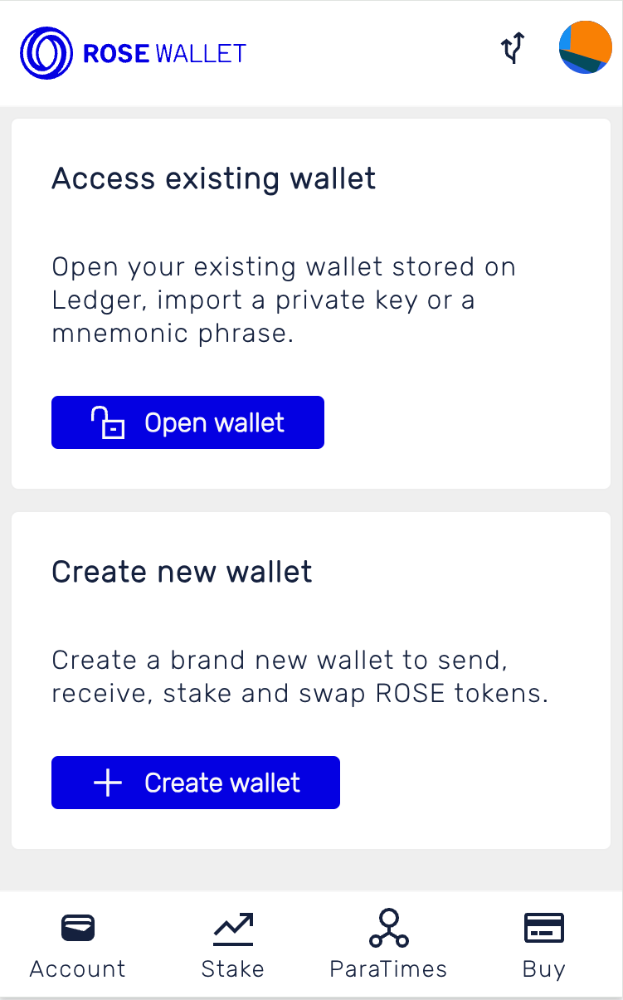

Fill in the "Account name" that will appear later in the Account Management screen.

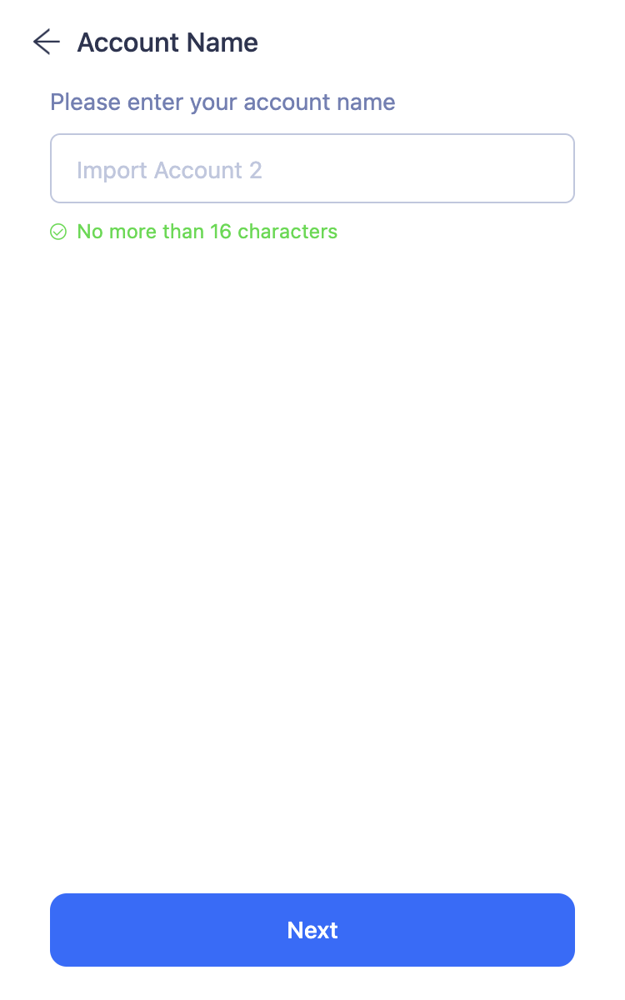

Next, paste your Base64-encoded Oasis or hex-encoded Ethereum private key.

:::note

You will need to import **the private key and not the mnemonics**. You can
derive a private key from the mnemonics with BIP39→BIP44 converter. For example
by [importing](../cli/wallet.md#import) the mnemonic into the Oasis CLI and
[exporting it](../cli/wallet.md#export).

:::

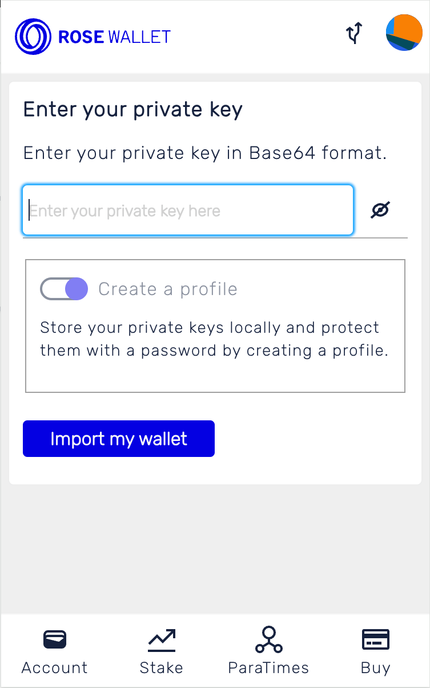

Your newly imported account will, depending on the account type, appear under
the "Oasis Account" or "Ethereum-compatible Account" sections in the Account
Management screen. Check that the Oasis or Ethereum address shown at the bottom
that it matches the address shown to you when you generated the keypair.

:::danger

In older versions of the ROSE Wallet - Browser Extension there was also another
Bech32-encoded version of the Ethereum address shown in the Ethereum-compatible
wallet. This address is used in the backend for setting the allowance policy
on the Oasis Network. **If you can see it, you should immediately update
your Wallet Extension! The Bech32-encoded address of the Ethereum-compatible
account must never be used for withdrawing ROSE to. The signature schemes are
incompatible (the consensus layer only supports Ed25519) and those tokens will
not be accessible anymore!**

:::

## Ledger

1. Plug your Ledger device into your computer and log into the Oasis app on-device

2. Open the Oasis Chrome Extension Wallet and click the account icon on the top
   right. Select Ledger on the bottom right of the app.

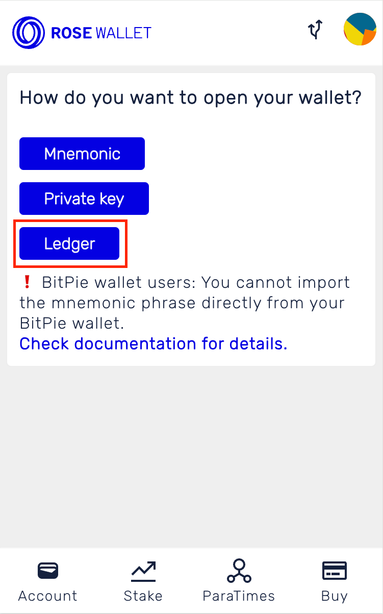

4. Follow user onboarding flow clicking "Next" as you move forward with set up.

5. You'll see a pop-up in your Chrome Browser asking you to select  which device
to connect. Click on your Ledger device. Then click "Connect".

   :::note

   You may need to resize the pop up window to see all buttons.

   :::

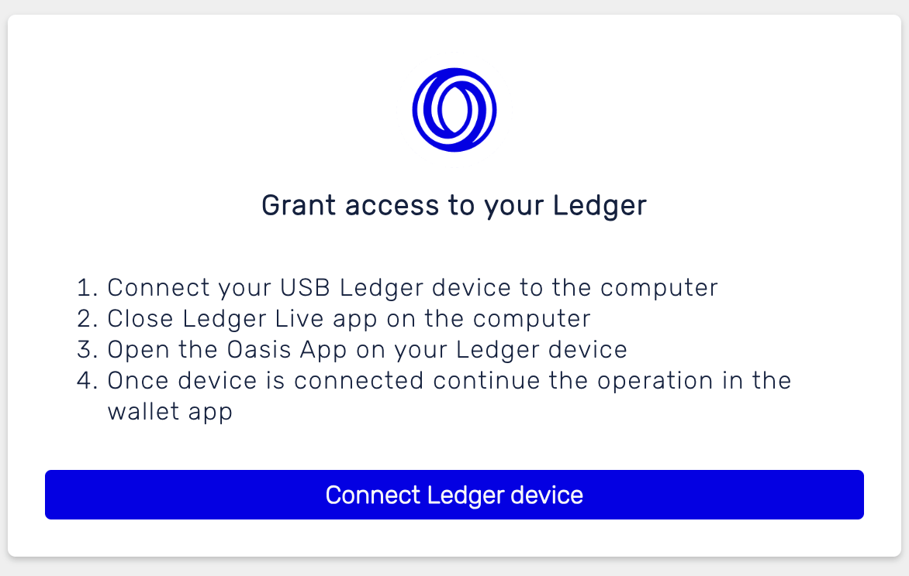

6. Follow the next onboarding steps to upload the correct Ledger account, clicking "Confirm" when complete.

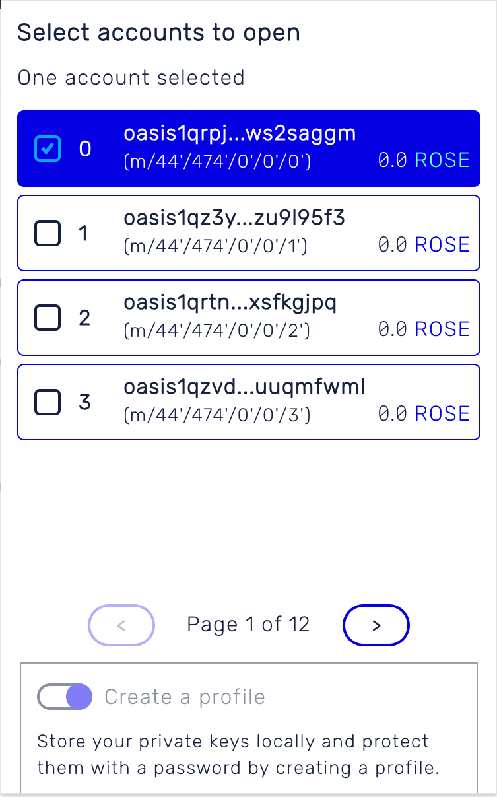

7. Use your Ledger to send, receive and stake on the Oasis Network!

## Transfer

<Tabs>
    <TabItem value="Send">
        1. Click the avatar on the top right corner
        2. Pick an account you want to transfer tokens out of
        3. Click "Send"
        4. Type in the token amount under "Amount"
        5. Type in the Receiver’s wallet address
        6. Click "Next"
        7. Check the "Send Details"; if everything looks good to you, click "Confirm"
        8. Wait for a couple of seconds, and you’ll get a status update of your transaction
        9. Go back to the Account page, and you’ll see the transfer has gone through
    </TabItem>
    <TabItem value="Receive">
        Click ‘Receive’ on the Account page, and you’ll get the QR code as well as the
        wallet address in text format
    </TabItem>
</Tabs>

## Stake

1. Click "Staking" on the Account main page
2. Go to "Validator node", and select a node you want to delegate your tokens to.
3. Click into the node you want to delegate your tokens to, and click "Add Escrow"
4. Fill in the amount you want to delegate under "Amount" and click "Next"
5. Check the "Delegate info", if everything looks good to you, click "Confirm"
6. Go to "My delegate" and you will see which node you just delegated tokens to and by how much

## ParaTimes

Switch to the *ParaTimes tab* to deposit and withdraw ROSE to or from the
ParaTimes.

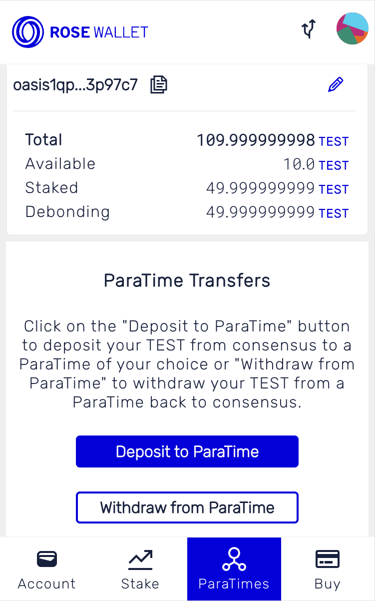

:::tip

At time of writing, depositing and withdrawing ROSE to and from ParaTimes
works only for the accounts **imported from the private key or the mnemonic**.
If you want to use a hardware wallet, please use the [Oasis CLI].

:::

<Tabs>
    <TabItem value="Deposit">

For the sake of demonstration, we'll continue with the Sapphire ParaTime, but
the Emerald or Cipher ParaTimes work just as well. Under the Sapphire label
click on the "To ParaTime" button.

Fill in the "Amount" of ROSE that you want to transfer to Sapphire and, in our
case, your Ethereum-compatible address in the "To" field you imported/created
before. Then, click "Next", review and confirm the transaction.

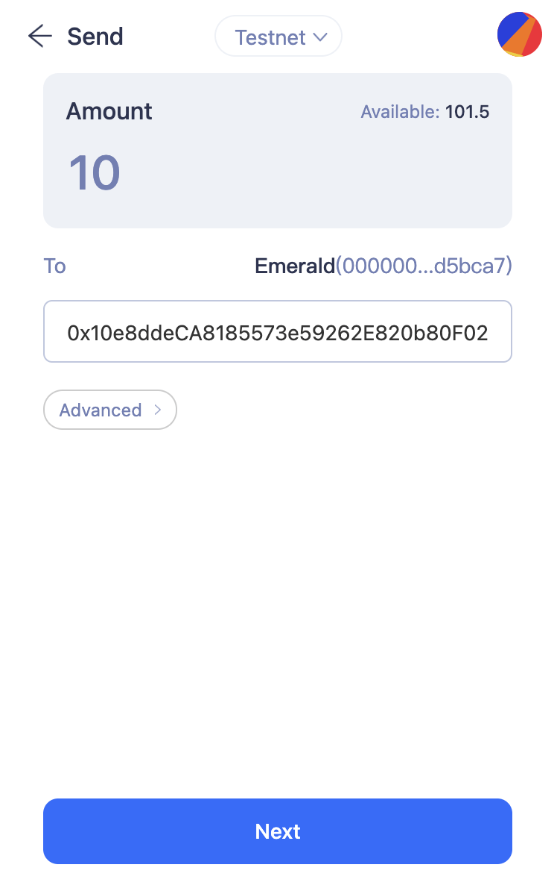

If everything goes well, you will see a successful ParaTime transaction in your
account history.

    </TabItem>
    <TabItem value="Withdraw">
You can withdraw your ROSE from the ParaTime back to your consensus account by first
selecting your ParaTime account in the *Account Management* screen. Next, switch to
ParaTimes tab and click on the "To Consensus" button near the ParaTime entry.
Fill in the "Amount" and your Bech32-encoded consensus layer address and confirm
the withdrawal. In a few moments you will have your ROSE accessible on the
consensus layer.

:::danger

If you want to transfer ROSE to an exchange and you currently have them
deposited on Sapphire, **we strongly recommend that you withdraw ROSE
to your ROSE Wallet first and then perform a regular token transfer to your
Oasis address on the exchange!** The ParaTime's withdrawal procedure involves a
number of steps as described in the introduction and some exchanges may not
recognize this transaction as a valid transaction for funding your account on
the exchange.

:::

:::tip

Advanced users (e.g. those running ParaTime [compute nodes]) may need to
withdraw ROSE from ParaTimes stored in their `oasis1` accounts, for example to
claim their ParaTime execution rewards. The ROSE Wallet - Browser Extension does
not support such withdrawals. Use the [`oasis account withdraw`] command which
is part of the [Oasis CLI] instead, for example:

:::

[compute nodes]: ../../../node/run-your-node/paratime-node.mdx
[Oasis CLI]: ../cli/README.md
[`oasis account withdraw`]: ../cli/account.md#withdraw
    </TabItem>
</Tabs>

You can check the balance of your consensus and ParaTime accounts by opening the
*Account Management* screen and selecting the corresponding account. Then click
on the back arrow. The *Wallet* tab will show you the balance on the consensus
layer and for ParaTimes navigate to the *ParaTimes tab*. There you will notice
the available amount of ROSE per each ParaTime.

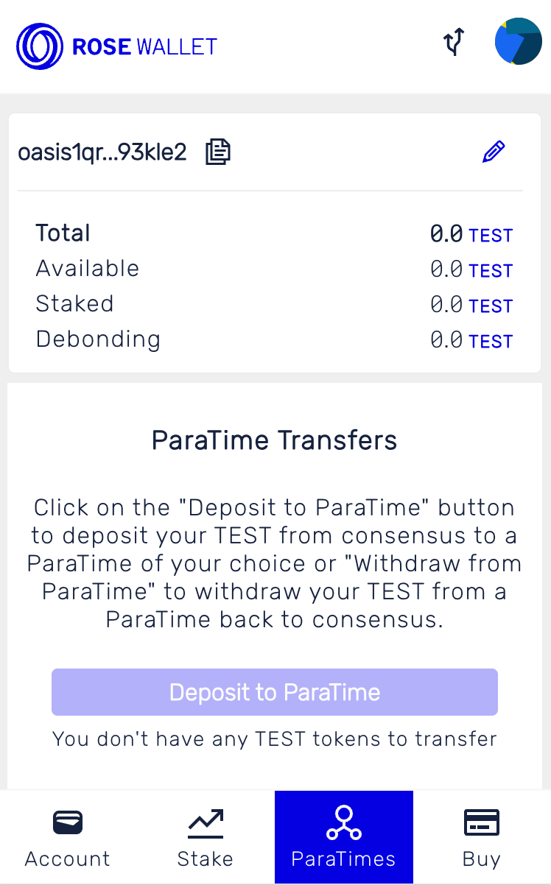

For EVM-compatible ParaTimes, you can as well verify the balance in
[Metamask](../README.mdx#metamask) or a built-in wallet in the Brave browser:

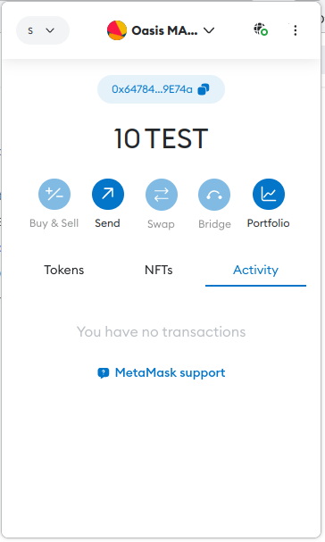
