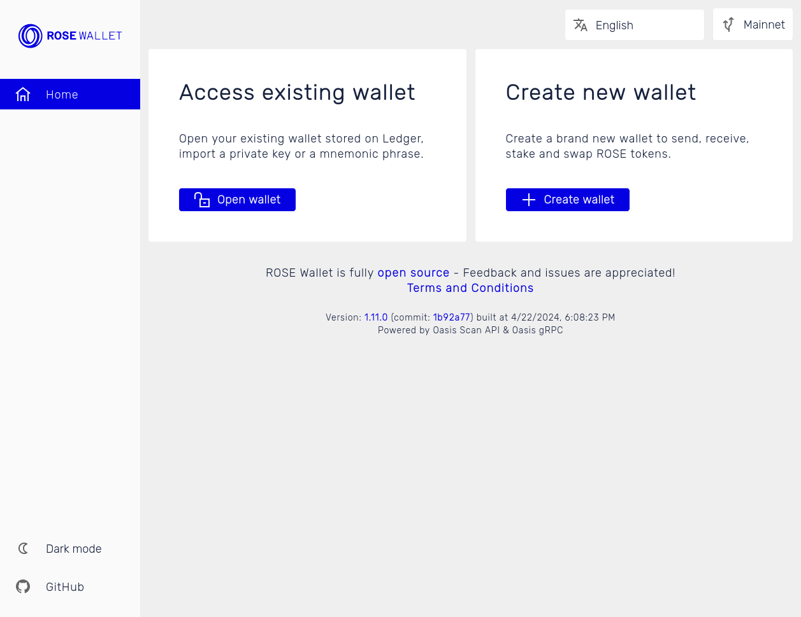
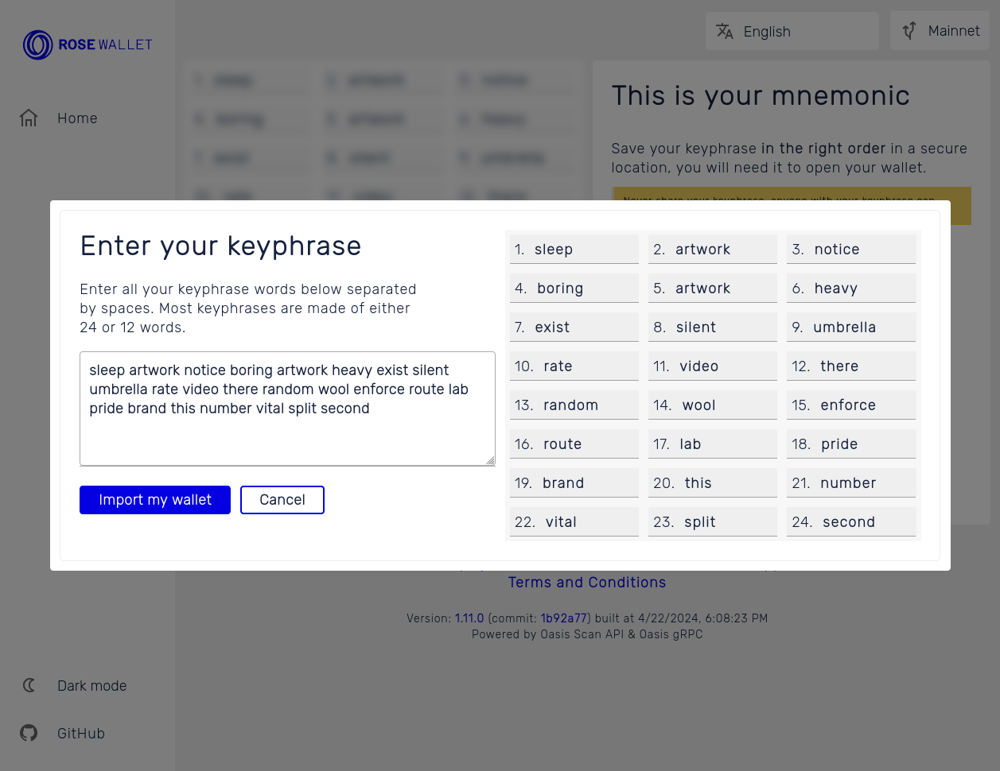
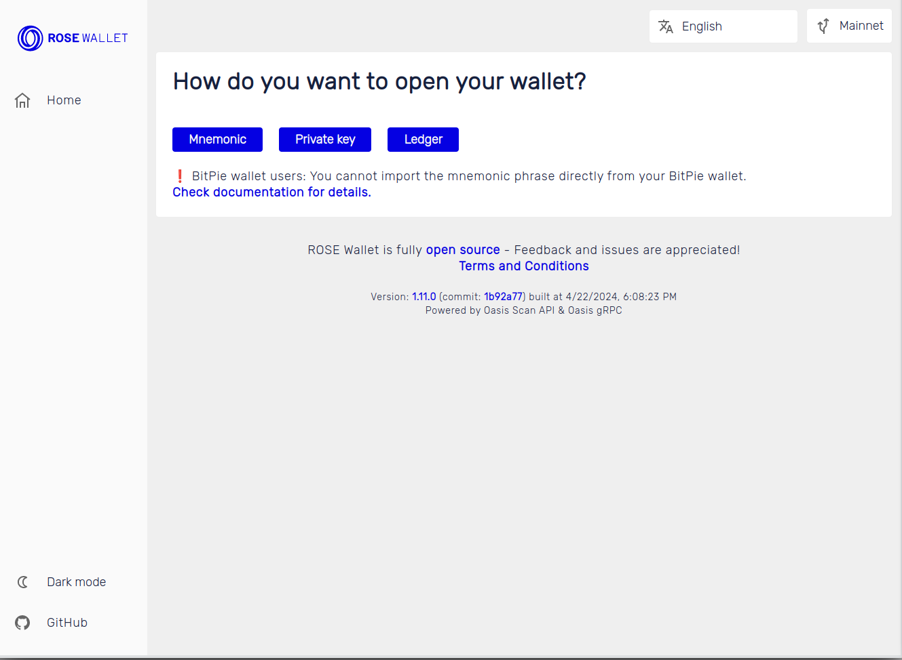
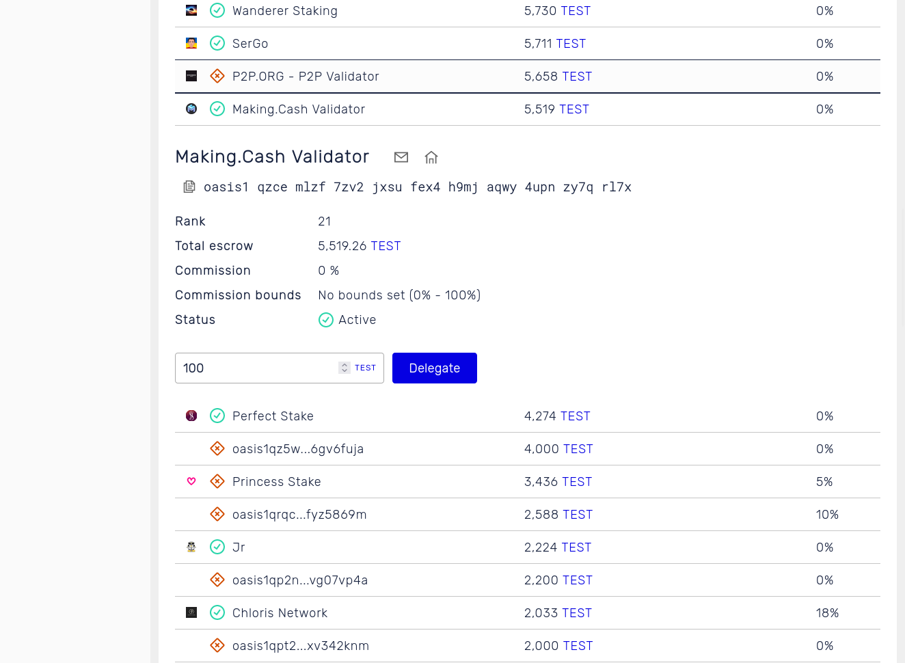
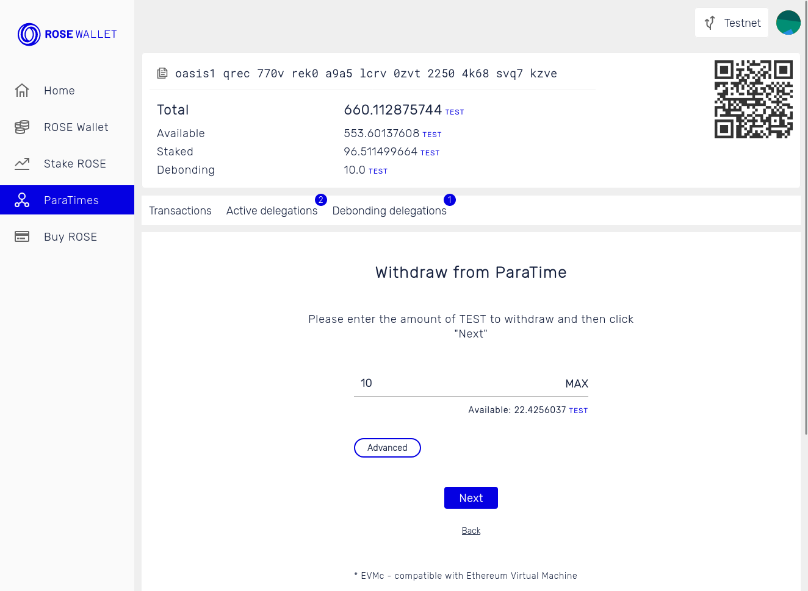
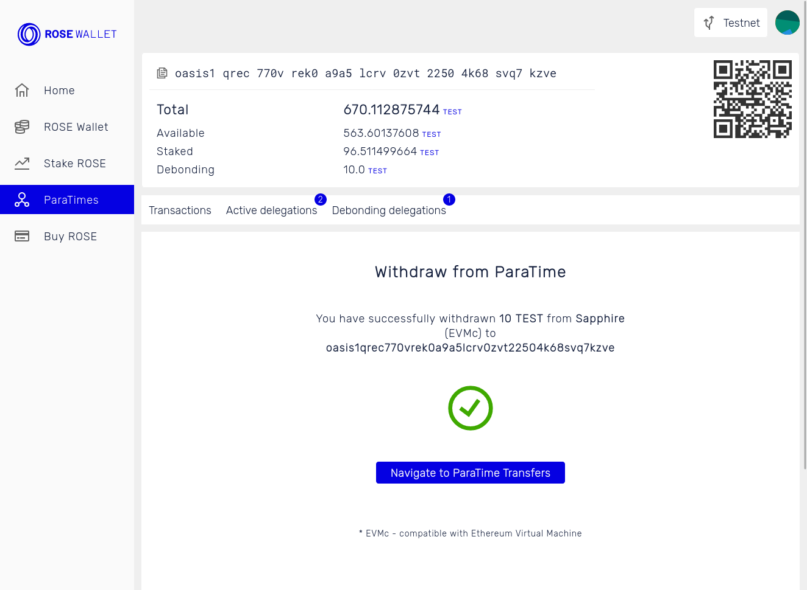
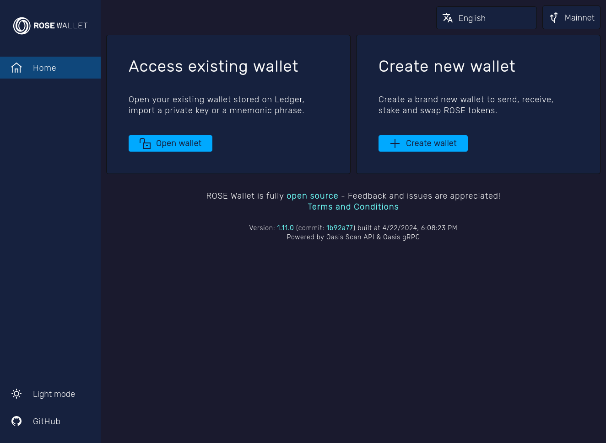

import Tabs from '@theme/Tabs';
import TabItem from '@theme/TabItem';

# ROSE Wallet - Web

This is the Oasis Foundation-managed non-custodial web wallet for the Oasis
Network. You can access it by visiting **[wallet.oasis.io](https://wallet.oasis.io)**.

:::note

The wallet was designed to work with any modern browser. In order to use the
[Ledger hardware wallet](../holding-rose-tokens/ledger-wallet.md) though, **you
will need the WebUSB support**. At time of writing, this was only available in
[Chrome](https://www.google.com/chrome/) and other
[Chromium](https://www.chromium.org/Home)-based browsers.

:::

Opening the wallet for the first time will show the *Home screen* where you can
choose to [create a new account](#create-a-new-account) or
[open an existing one](#import-an-existing-account).

## Create a New Account

The next screen is devoted to your mnemonic—**a unique list of
words representing your account(s)**. Review the information on this page very
carefully. Save your
mnemonic in the right order in a secure location.

:::caution

Your mnemonic (i.e. keyphrase) is required to access your wallet. Be sure to
store it in a secure location. If you lose or forget your mnemonic, you will
lose access to your wallet and any token funds contained in it.

:::

:::danger Never share your mnemonic (i.e. keyphrase)!

Anyone with your mnemonic can access your wallet and your tokens.

:::

After you’ve saved your mnemonic, click the “I saved my keyphrase” checkbox and
then click on the “Import my wallet” button.

Next, you will need to confirm your mnemonic by writing the mnemonic into the
text area. The ROSE Wallet will check for any typos and missing words. When
done click the "Import my wallet" button.

### Account Derivation

If you correctly entered the mnemonic the **account derivation popup**
will appear containing a list of `oasis1` addresses with their
balances on the right. These are the accounts derived from your
mnemonic based on the [ADR-8 derivation scheme][adr8]. Select one or more
accounts and click the "Open" button to import them into your wallet.

### User Profile

If you want to permanently store the keys of selected accounts, select the
"Store private keys locally, protected by a password" box. After entering a
password below, this will **instantiate a profile inside the local store of your
browser to safely store your keys**. To access them, you will need to enter the correct
password each time you will open the ROSE Wallet - Web.

Finally, you will be taken to the *Wallet screen*, containing
information about your account balance, recent transactions and more.

[adr8]: ../../../adrs/0008-standard-account-key-generation.md

## Import an Existing Account

On the "Open wallet" page select whether you want to open your
wallet via a mnemonic, a private key, or a Ledger hardware wallet.

<Tabs>

<TabItem value="Mnemonic">

In the "Enter your keyphrase here" field, enter each word of your mnemonic
separated by a space. Then, hit the "Import my wallet" button.

The [account derivation popup](#account-derivation) will be shown where
you can pick one or more derived accounts to import.

:::info

The ROSE Wallet uses English mnemonic phrase words as defined in
[BIP39](https://github.com/bitcoin/bips/blob/master/bip-0039.mediawiki).
You can find a complete list of all valid phrase words
[here](https://github.com/bitcoin/bips/blob/master/bip-0039/english.txt).
If you misspelled a word, the wallet will warn you.

:::

</TabItem>

<TabItem value="Private Key">

Paste your Base64-encoded Ed25519 private key in the "Enter your private key
here" field and then click on the "Import my wallet" button.

Selecting "Store private keys locally, protected by a password" will instantiate
the [user's profile](#user-profile).

:::tip

The 64 bytes long keypair is the preferred format for importing your account. It
consists of **two 32-byte parts**:

1. The first part is the **private key** used for signing the transactions
   (e.g. for sending tokens from your account).
2. The second part is a **public key** used to verify the signatures
   of your transactions and also derive your account's address of the form
   `oasis1...`.

:::

:::caution

If you entered the 64-byte keypair then the wallet checks whether the public
key corresponds to its private counterpart. **If you mistyped any character, the
wallet will not allow you to proceed.**

However, if you only typed in the first 32-byte part there is **no error
detection possible. It is imperative that you **correctly input all characters**
and not mix similar characters like the big O and 0 or big I and 1! If unsure,
we suggest that you perform a test transaction the first time you import your
wallet from the private key so you can rest assured the key is valid.

:::
</TabItem>

<TabItem value="Ledger">

To use the Ledger hardware wallet, make sure you have your Ledger device readily
available and have familiarized yourself with the [Oasis-specific Ledger usage instructions](../holding-rose-tokens/ledger-wallet.md).

Next, click on the "Select accounts to open". If this is the first time you're
using Ledger with your browser, a system popup will appear showing the list of
Ledger devices connected to your computer and requesting permission to use it.
Select one and then click the "Connect" button.

The [account derivation popup](#account-derivation) will be shown next,
where you can pick one or more derived accounts to import.

:::warning

To date, only Chromium-based browsers support WebUSB component which is required
to access your Ledger device.

:::

</TabItem>
</Tabs>

Finally, you will be taken to your *Wallet screen*, containing information about
your account balance, recent transactions and more.

## Transfer

<Tabs>

<TabItem value="Send tokens">

To transfer tokens, open the *Wallet screen*. Fill in the "Recipient" and
"Amount" fields and click "Send". A confirmation popup will appear showing
transaction details. Carefully review the transaction and click the "Confirm"
button.

</TabItem>
<TabItem value="Receive tokens">

To receive tokens, open the *Wallet screen* and copy the `oasis1` account
address at the top. You can also scan or store a QR code corresponding to your
account on the right side of the screen.

</TabItem>
</Tabs>

## Stake

To [stake your tokens](../staking-and-delegating.md) open the *Stake screen*.
The list of validators will appear, their status, current escrow and the
commission fee. Follow the sections below to delegate or undelegate your tokens.

<Tabs>
<TabItem value="Delegate">

1. To delegate tokens, select the preferred validator you wish to delegate your
   tokens to by clicking on it. Fill in the amount and click the "Delegate"
   button.

   

2. A confirmation popup will appear showing transaction details. Carefully
   review the transaction and click the "Confirm" button.

   

3. In a while, your delegated tokens will appear under the "Active delegations"
   tab.

   

</TabItem>
<TabItem value="Undelegate">

1. To undelegate, click on a validator in the "Active delegations" tab, enter
   the amount of tokens you wish to undelegate and click "Reclaim". You can also
   click the "Reclaim all" button to undelegate all delegated tokens from this
   validator.

   

2. A confirmation popup will appear showing transaction details. Carefully review
   the transaction and click the "Confirm" button.

   

3. In a while, your undelegated tokens will enter the **debonding period**. You can
   check out all the delegations that are in the debonding period in the "Debonding
   delegations" tab.

   

</TabItem>
</Tabs>

## ParaTimes

To move tokens from the consensus layer to a ParaTime (**deposit**) or the
other way around (**withdrawal**), open the *ParaTime screen*. Click on the
"Deposit to ParaTime" or "Withdraw from ParaTime" button and follow the sections
below.

<Tabs>
<TabItem value="Deposit">

1. Select the ParaTime you wish to deposit your tokens to and click "Next".

   

2. Enter the recipient address in the ParaTime. For EVM-compatible
   ParaTimes you will need to enter a hex-encoded address starting with `0x` and
   for other ParaTimes the Oasis native address starting with `oasis1`. Click
   "Next".

   

3. Enter the amount to deposit.

   The gas fee and price will automatically be computed. You can toggle the
   "Advanced" button to set it manually.

   Finally, click "Next".

   

4. Review deposit details, check the "I confirm the amount and the address are
   correct" and click the "Deposit" button.

   

   Once the deposit transaction is confirmed the tokens will appear on your
   ParaTime account.

   

</TabItem>
<TabItem value="Withdraw">

1. Select the ParaTime you wish to withdraw your tokens from and click "Next".

   

2. Enter the recipient address on the consensus layer below.

   If the ParaTime is EVM-compatible you will also need to enter the
   **hex-encoded private key** of the account on the ParaTime which you are
   withdrawing from. If you are using a [profile](#user-profile), the **private
   key will be stored for any future withdrawals**. For other ParaTimes, the
   withdrawal transaction will be signed with the **private key of your
   currently selected account in your wallet**.

   Click "Next" to continue.

   

3. Enter the amount to withdraw.

   The gas fee and price will automatically be computed. You can toggle the
   "Advanced" button to set it manually.

   Finally, click "Next".

   

4. Review withdrawal details, check the "I confirm the amount and the address
   are correct" and click the "Withdraw" button.

   

   Once the withdrawal transaction is confirmed the tokens will appear on your
   consensus account.

   

</TabItem>
</Tabs>

## Buy

You can buy ROSE directly from within the wallet by opening the *Buy screen*.
The ROSE Wallet team integrated a 3rd party [Transak](https://transak.com/)
service which performs the necessary KYC, supports various payment methods, buys
the tokens on the market and transfers them to your currently selected account.

## Account options

When you have at least one account opened, click on the account jazz icon in the
top-right corner. A popup will appear.

### My Accounts

Select a different account and click "Select" to switch the current account.

### Contacts

Contains a list of named addresses similar to the address book.

### Profile

Used to change the password or delete your [profile](#user-profile).

### Settings

You can change the wallet language and toggle between the light and the dark
theme.

If you do not have a profile, a sun/moon icon will be shown in the
lower-left corner.

## Share your feedback with us

If you have any questions or issues using the
[ROSE Wallet - Web](https://github.com/oasisprotocol/oasis-wallet-web/), you
can [submit a GitHub issue](https://github.com/oasisprotocol/oasis-wallet-web/issues),
and the dev team will take a look. You can also connect with us to share your
feedback via [Discord](https://oasis.io/discord) or
[Telegram](https://t.me/oasisprotocolcommunity).
