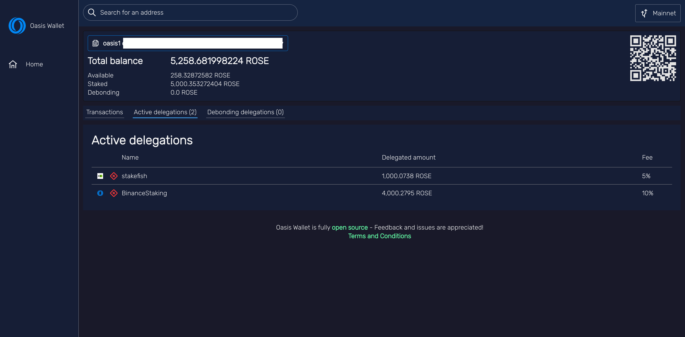

# Staking and Delegating

Staking and Delegation on the Oasis Network is a wonderful way to hold your ROSE
tokens.
Here are a few key resources to get started!

## Rewards and Tokenomics

Staking rewards vary over the course of the Network. In the first four years rewards will range between 20-2% over time. More [here](/oasis-network-primer/token-metrics-and-distribution#staking-incentives).

## How to Stake and Delegate

The Oasis Network is supported by an amazing community of validators and infrastructure providers. Many provide services to help you set up your own validator node and/or make delegation easy.

### Tools to use for Staking and Delegation

In addition to using the [Oasis CLI](advanced/oasis-cli-tools/README.md) for generating the `staking.AddEscrow` transaction, there is a number of wallets and custodians that support staking and delegation on the Oasis Network. Those include:

* [Oasis Wallet - Web](oasis-wallets/web.md)
* [Oasis Wallet - Browser Extension](oasis-wallets/browser-extension.md)
* [Copper.co](staking-and-delegating.md#rewards-and-tokenonomics) (custodian)
* [Anchorage](https://anchorage.com) (custodian)
* [Finoa](https://finoa.io) (custodian)

You can obtain the list of active validators including their fee and contact information at the Oasis block explorers such as the [Oasis Scan](https://www.oasisscan.com/validators) or the [Oasis Monitor](https://oasismonitor.com/validators). The wallets will also obtain that list from one of the block explorers so you can easily browse through the validators and select the one that you prefer.

:::info

Some validators prefer anonymity and they do not list their name or any contact information. In this case only their entity's Oasis address is shown.

:::

You can stop staking and reclaim your tokens at any time. This can be done with a CLI tool or any of the wallets mentioned above. After sending the corresponding `staking.ReclaimEscrow` transaction, your tokens will, to ensure the network security and robustness, enter the **debonding period** defined in the [genesis](../oasis-network/network-parameters.md) document. Currently, this period is 336 epochs (around 14 days) and no staking rewards are earned for the duration of this period. Afterwards your ROSE will be free to use.

:::danger

**Staking your ROSE is a different transaction than sending them!** When you stake your tokens (`staking.Escrow` transaction), you can reclaim them at any time. Sending your tokens (`staking.Transfer` transaction) on the other hand means that the **receiver will own the tokens and there is no way of retrieving that tokens back by yourself**.

If you happen to send your tokens to the validator instead of staking them, try contacting the validator via email or other channels listed on the block explorers and kindly ask them to send the tokens back to you. Know that it is completely up to them to send the tokens back and there is no other mechanism of doing it.

:::

### Verify your Staking and Delegations

* Use the [Oasis Scan block explorer](https://www.oasisscan.com) and verify your Staking (Escrow) by entering your `oasis1` wallet address. Check the "Amount" column in the "Escrow Active" section to see all your active ROSE delegations.

* Alternatively, you can use the [Oasis Web Wallet](https://wallet.oasisprotocol.org), to verify the status of your delegations.

:::info

You don't need to open your wallet, you can just search your `oasis1` address.

:::

### Run your own Node

If you're interested in running your own node and become a validator you can get started [here](/operators/). Be sure to [join the **#node-operators** channel on Discord and sign up for the node operator mailing list](../oasis-network/connect-with-us.md#social-media-channels)!
