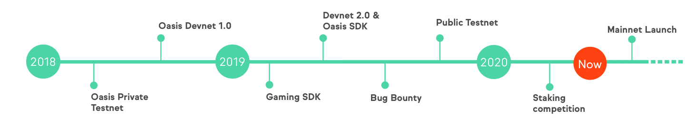

# Node Operator Overview

The Oasis Network's decentralized consensus layer is comprised of nodes operated by independent Node Operators. This documentation is intended to assist any individual or organization in participating in the network as a Node Operator.

## Oasis Network Roadmap

## Quick Navigation









